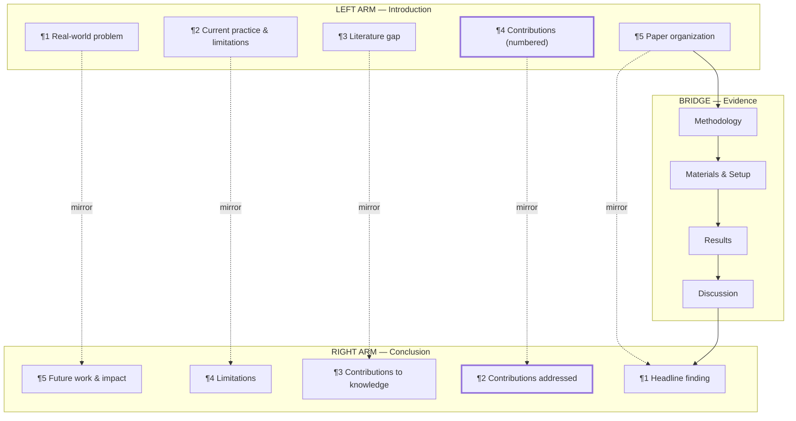

# Horseshoe Paper Writing Skill

Write **submission-ready** engineering research papers using the **Horseshoe
Diagram Method** — a U-shaped narrative where the Introduction and Conclusion
are **mirror-image arms** that must align point-for-point, with Methods and
Results forming the connecting bridge at the bottom. Paired with a
**standardized journal-submission format**: section order, reference styles
for major venues, B&W academic diagram conventions, table formatting,
formula-usage rules, and explicit ML-paper diagramming guidance.

This skill is **complementary** to `research-paper-generation-skill`:
- `research-paper-generation-skill` → the **production pipeline** (data
  gathering, framing, diagrams, DOCX, verification).
- `horseshoe-paper-writing-skill` → the **narrative structure** (section
  pairing, mirror alignment, journal-submission conventions).

Load both when producing a new paper from scratch.

---

## 1. The Horseshoe Diagram Method

### 1.1 Core Idea

A research paper is shaped like a **horseshoe** (an inverted-U / ⌒). The two
open ends point **upward** and must face each other:

```
   INTRODUCTION                   CONCLUSION
        ╲                            ╱
         ╲    (left arm)    (right arm) ╱
          ╲                          ╱
           ╲                        ╱
            ╲______________________╱
                    (bridge)
              METHODS → RESULTS → DISCUSSION
```

- **Left arm (Introduction)** funnels **inward**: broad context → specific
  problem → literature gap → research questions / contributions.
- **Bridge (bottom of U)** is the **evidence**: Methodology, Results,
  Discussion. It is the only thing connecting the two arms.
- **Right arm (Conclusion)** flares **outward**: findings → implications →
  limitations → future work → broader context.

### 1.2 The Mirror Principle (the single most important rule)

> **Every claim, question, or contribution raised in the Introduction MUST
> have a mirrored partner in the Conclusion.** No new content appears in the
> Conclusion — it only **answers** what the Introduction **promised**.

If the Introduction says *"This study makes three contributions"*, the
Conclusion must address **all three, in the same order**, with the evidence
produced in the bridge. If the Introduction poses Research Questions RQ1,
RQ2, RQ3, the Conclusion must answer RQ1, RQ2, RQ3 in that order.

A reviewer must be able to **fold the paper along the bridge** and have each
intro paragraph line up with its conclusion partner.

### 1.3 Why "Horseshoe" (not "Hourglass")

| Aspect | Hourglass | **Horseshoe** |
|--------|-----------|---------------|
| Shape | Broad → narrow → broad (linear) | Two parallel arms joined at bottom (U) |
| Emphasis | Vertical flow of generality | **Mirror symmetry** between intro and conclusion |
| Failure mode | Drift between intro promises and conclusion claims | Same, but the horseshoe makes the drift *visible* and fixable |
| Reviewer test | "Does the paper go broad again?" | "**Does each intro promise have a matched conclusion answer?**" |

The horseshoe method forces the author to **explicitly map** intro→conclusion
pairs **before** writing the bridge. This produces tighter, more reviewable
papers.

### 1.4 The Seven-Step Horseshoe Workflow

```
Step 1  →  Draft the LEFT ARM (Introduction) — promises, contributions, RQs
Step 2  →  Draft the RIGHT ARM (Conclusion) — answers, mirroring Step 1 point-by-point
Step 3  →  Build the PAIRING TABLE (intro paragraph ↔ conclusion paragraph)
Step 4  →  Draft the BRIDGE (Methods, Results, Discussion) to connect each pair
Step 5  →  Write the Abstract (compress the entire horseshoe into ~250 words)
Step 6  →  Write front-matter & back-matter sections (Practical Applications /
            Highlights, Data Availability, Author Contributions, Acknowledgments)
Step 7  →  Run the MIRROR AUDIT (§5) — verify every intro item has a partner
```

**Never write the bridge first.** The arms define the contract; the bridge
fulfills it. Authors who write methods-first routinely produce papers whose
conclusions drift from their introductions.

---

## 2. Standardized Journal-Submission Section Order

The structure below is accepted by the major engineering-journal families
(ASCE, Elsevier built-environment, IEEE, Springer, MDPI). Section names vary
slightly by venue (see §2.2 for the venue-specific rename map); the
**ordering and content of each section are stable across venues**.

### 2.1 Canonical Section Order

| # | Section | Horseshoe slot | Required? |
|---|---------|----------------|-----------|
| 1 | **Abstract** | Compressed whole | Always |
| 2 | **Practical Applications / Highlights / Implications** | Front-matter | ASCE mandatory; Elsevier common; IEEE optional |
| 3 | **Introduction** | Left arm | Always |
| 4 | **Literature Review** (a.k.a. Related Work) | Left arm | Always |
| 5 | **Methodology** | Bridge — left | Always |
| 6 | **Materials and Experimental Setup** | Bridge — middle | Always (may merge with §5 for theory papers) |
| 7 | **Results** | Bridge — right | Always |
| 8 | **Discussion** | Bridge — right | Always (may merge with §7 for short papers) |
| 9 | **Conclusions** | Right arm | Always |
| 10 | **Data Availability Statement** | Back-matter | ASCE / Elsevier mandatory; IEEE / Springer recommended |
| 11 | **Acknowledgments** | Back-matter | Always (if funding received) |
| 12 | **Author Contributions** (CRediT) | Back-matter | ASCE / Elsevier mandatory; others recommended |
| 13 | **References** | Back-matter | Always |
| (—)| **Appendices** (optional) | After references | Optional |

### 2.2 Venue-Specific Section Rename Map

The structure is constant; only the **labels** change. Pick the column that
matches your target venue.

| Canonical section | ASCE | Elsevier (Autom. Constr., Build. Environ.) | IEEE (Sensors, Access) | MDPI (Sensors, Buildings) | Springer (ISARC proc.) |
|---|---|---|---|---|---|
| Practical Applications | **Practical Applications** (mandatory) | **Highlights** (3–5 bullets) or **Implications** | (omit; fold into Conclusion) | **Practical Implications** (optional) | (optional) |
| Literature Review | "Literature Review" | "Related Work" or "Literature Review" | "Related Work" | "Related Work" | "Background" |
| Methodology | "Methodology" or "Proposed Framework" | "Methodology" or "Methods" | "Methodology" or "Approach" | "Materials and Methods" | "Methodology" |
| Materials & Setup | "Materials and Experimental Setup" | "Experimental Setup" | "Experimental Setup" | (merged into Methods) | "Experimental Setup" |
| Discussion | "Discussion" | "Discussion" | (folded into Results) | "Discussion" | (folded into Results) |
| Author Contributions | CRediT (mandatory) | CRediT (mandatory) | optional | CRediT (mandatory) | optional |
| Data Availability | mandatory | mandatory | recommended | mandatory | recommended |

### 2.3 Standardized Submission Conventions

These conventions apply across all venues unless noted:

1. **Problem-first opening.** The first paragraph of the Introduction names a
   *real* engineering / industry pain point (cost, safety, downtime, hazard,
   accuracy gap) — *not* a literature gap. The literature gap appears only
   after the reader cares about the problem.
2. **A framework/architecture figure in §Methodology** is mandatory for any
   paper proposing a method. Labelled block diagram of the proposed method
   as **Figure 1** (or Figure 2 after a dataset overview).
3. **Comparison tables**: best result **bold**, second-best marked with a
   dagger † (or underline). Per-class breakdowns (precision / recall / F1)
   are preferred over single accuracy figures.
4. **Held-out / out-of-sample** evaluation. Always report a test set not
   used during model selection, and discuss generalization explicitly.
5. **Limitations subsection** is explicit — placed in Discussion or at the
   end of Conclusions. Never omitted. Reviewers penalize papers that hide
   limitations.
6. **CRediT author statement** uses the standard 14 roles (see §3.10).
7. **First-person plural** ("we") for authorial voice — never "the authors"
   referring to themselves. Active voice preferred; passive only for
   established facts.
8. **Hedged generalization claims** — never overstate. Use phrases like
   *"demonstrates potential for similar environments"* rather than *"works
   universally"*.
9. **Quantitative over qualitative** — numbers, percentages, effect sizes;
   never "significant improvement" without a metric and statistical test.
10. **Acronyms defined on first use.** Every acronym (NDE, CNN, ML, etc.)
    is spelled out on first use — "non-destructive evaluation (NDE)" — then
    used consistently thereafter. Field-standard acronyms (NDE, NDT, CNN,
    ML, AI) may appear without definition in domain-specific venues *only*
    when universally recognized; method-standard acronyms (SVM, LR, GBM,
    STFT, MFCC, ROC, AUC) must always be defined. Do not use an acronym
    that appears fewer than three times in the paper. Papers with **10+
    distinct acronyms must include a Notation & Acronyms table** at the
    start of §Methodology (see §7.5.1).
11. **Manuscript formatting (double-spaced, serif font, 1-inch margins).**
    Submission-ready DOCX manuscripts use **double line spacing** throughout
    (body text, references, captions), **12pt Times New Roman** (or Arial
    as alternative), and **1-inch margins** on all sides. This gives
    reviewers room to annotate and matches the submission requirements of
    ASCE, Elsevier, IEEE, Springer, and MDPI. The journal replaces
    formatting for the published version — manuscript formatting only
    matters for the review phase. See §7.6 for the pandoc
    `reference-manuscript.docx` template.

---

## 3. Section-by-Section Writing Guide (Horseshoe Slots)

Each section below has a **template file** under `section-templates/`. Load
the relevant template before drafting.

### 3.1 LEFT ARM — Introduction (`section-templates/01-introduction.md`)

**Horseshoe role:** Promise what the paper will deliver.

**5-paragraph structure (each paragraph mirrors one in §3.7):**

| ¶ | Content | Mirrors Conclusion ¶ |
|---|---------|----------------------|
| 1 | **Real-world problem** (industry pain point, with stakes — cost, safety, downtime) | 5 (broader impact) |
| 2 | **Current practice & its limitations** (what practitioners do today, why it falls short) | 4 (limitations of this study) |
| 3 | **Literature gap** ("to the best of our knowledge, no prior work has …") | 3 (contributions to knowledge) |
| 4 | **Approach preview** + **explicit numbered contributions list** | 2 (summary of contributions, addressed one-by-one) |
| 5 | **Paper organization** ("The remainder of this paper is organized as follows. §2 …") | 1 (key finding headline) |

**Critical:** Paragraph 4 must contain a **numbered list of contributions**,
e.g.:

> The contributions of this paper are as follows:
> 1. We propose {METHOD NAME}, a {ONE-LINE DESCRIPTION}.
> 2. We construct and release {DATASET}, the first {PROPERTY} dataset for {TASK}.
> 3. We conduct extensive experiments demonstrating {QUANTIFIED RESULT}.

These contributions will be **answered verbatim** in the Conclusion (§3.7).

### 3.2 LEFT ARM — Literature Review (`section-templates/02-literature-review.md`)

**Funnel structure** (3 subsections, narrowest at the end):

1. **Broad domain** — e.g., "automated defect detection in civil infrastructure."
2. **Specific task family** — e.g., "acoustic methods for NDE of building envelopes."
3. **The exact gap** — e.g., "no prior work addresses amplitude-agnostic
   spectral features for hollow-wall detection with smartphones."

End with a one-paragraph **gap statement** that points directly at the
Methodology section.

### 3.3 BRIDGE — Methodology (`section-templates/03-methodology.md`)

**Horseshoe role:** Define the framework. Must contain a **labeled
architecture block diagram** as Figure 1 (or Figure 2 after dataset
overview). See §6 for ML-paper diagramming rules (when to use system-level
vs. layer-level diagrams).

Required subsections:
- **3.x.0 Notation & Acronyms** — mandatory table at the very start of
  §Methodology when the paper uses 10+ distinct acronyms or 5+ math
  symbols not in common use. Lists every symbol, acronym, expansion, and
  first-use location (see §7.5.1 for format).
- **3.x.1 Overview** — one paragraph + the architecture figure.
- **3.x.2 Inputs / data format** — what the method ingests.
- **3.x.3 Components** — each pipeline stage with equations where required
  (see §7 for formula-usage rules).
- **3.x.4 Output / decision rule** — how a final classification is produced.

Use display math (`$$ ... $$`) only when justified by §7. Number every
equation `(1), (2), …` for in-text reference.

### 3.4 BRIDGE — Materials and Experimental Setup (`section-templates/04-materials-setup.md`)

Required content:
- **Dataset description** — sample counts, class distribution, capture
  method, sensor hardware, geographic/temporal provenance. A **table** of
  class counts is standard.
- **Pre-processing pipeline** — sample rate, normalization, augmentation.
- **Train/validation/test splits** — with rationale (random / stratified /
  by-site / by-subject). Always specify how splits prevent leakage.
- **Hyperparameters** — model architecture, optimizer, learning rate,
  batch size, epochs, early-stopping criterion.
- **Hardware** — GPU model, training time. Important for reproducibility.
- **Evaluation metrics** — precision/recall/F1, plus any domain-specific
  metric (ECE for calibration, IoU for segmentation, etc.).

### 3.5 BRIDGE — Results (`section-templates/05-results.md`)

Required content:
- **Main results table** — your method vs. baselines, with **bold** for
  best and dagger/underline for second-best. Caption above the table.
- **Per-class / per-condition breakdown** — never just accuracy. Precision,
  recall, F1 for each class. A confusion matrix figure is recommended.
- **Figures with captions** — every figure referenced in prose ("Fig. 3
  shows …"). Captions below figures, self-contained (state sample size and
  metric).
- **Statistical significance** where applicable — paired t-test or
  Wilcoxon, with p-values; mark with `*`, `**`, `***`.
- **Robustness across seeds** — report mean ± std across N seeds (N ≥ 3).

**NEVER** cherry-pick the best random seed.

### 3.6 BRIDGE — Discussion (`section-templates/06-discussion.md`)

Required content:
- **Why the method works** — mechanistic explanation tying back to the
  Methodology equations.
- **Comparison to prior work** — explicit deltas.
- **Ablation studies** (recommended) — remove each component, show the
  performance drop.
- **Failure cases** — show 2–3 examples where the method fails and diagnose why.
- **Limitations** — be explicit. Never omit.

### 3.7 RIGHT ARM — Conclusions (`section-templates/07-conclusions.md`)

**Horseshoe role:** Answer the Introduction's promises, point-for-point.

**5-paragraph structure (mirrors §3.1 in reverse):**

| ¶ | Content | Mirrors Introduction ¶ |
|---|---------|--------------------------|
| 1 | **Headline finding** (one quantified sentence: "We achieved X% on Y.") | 5 |
| 2 | **Contributions, addressed one-by-one** — for each numbered contribution in Intro ¶ 4, state the result that delivers it | 4 |
| 3 | **Contributions to knowledge** — what the field now knows that it didn't before | 3 (gap) |
| 4 | **Limitations of this study** — honest accounting of what the method cannot do | 2 (current practice limitations) |
| 5 | **Future work & broader impact** — how this generalizes to adjacent problems | 1 (real-world problem) |

**Critical:** Paragraph 2 must reference the numbered contributions from
Intro ¶ 4 in **the same order**, e.g.:

> Addressing contribution (1), the proposed {METHOD} achieves {METRIC}.
> For contribution (2), the {DATASET} is, to the best of our knowledge,
> the first … . For contribution (3), experiments confirm {QUANTIFIED RESULT}.

### 3.8 Abstract (`section-templates/08-abstract.md`)

Write it **last**. Four sentences:
1. **Problem** (1 sentence — why this matters).
2. **Method** (1–2 sentences — "To address this, we propose …").
3. **Key result** (with the single most important number — 1 sentence).
4. **Implication** ("These findings highlight …" — 1 sentence).

### 3.9 Practical Applications / Highlights (`section-templates/09-practical-applications.md`)

Practitioner-facing translation. Plain English, no equations, minimal
jargon. One paragraph (~150 words) covering:
- What the practitioner does with the result.
- What equipment / cost / skill it requires.
- Where it does NOT work (boundaries).
- Adjacent industries that could adopt it.

See §2.2 for the venue-specific name (Practical Applications / Highlights /
Implications / omitted).

### 3.10 Back-Matter (`section-templates/10-backmatter.md`)

- **Data Availability Statement** — required by ASCE / Elsevier. Standard
  phrasings in the template file.
- **Acknowledgments** — funding agencies with grant numbers; individuals who
  reviewed drafts; dataset contributors.
- **Author Contributions (CRediT)** — assign all 14 roles. The PI /
  corresponding author is typically: *Conceptualization, Methodology,
  Supervision, Funding acquisition, Writing—review & editing*.

---

## 4. Reference Style — Multi-Venue

### 4.1 Style by Venue

| Venue family | Style | In-text format | Example |
|--------------|-------|----------------|---------|
| **ASCE** (J. Constr. Eng. Manage., J. Comput. Civ. Eng., etc.) | ASCE house | `(Surname and Surname Year)` — no comma before year | `Smith, J. A., and B. C. Lee. 2023. "Acoustic NDE of walls." *Autom. Constr.* 145: 104689. https://doi.org/10.xxxx/xxxxx.` |
| **Elsevier** (Autom. Constr., Build. Environ., MSSP, etc.) | Elsevier author-year (default) or numbered | `(Surname and Surname Year)` or `[1]` | `Smith, J. A., & Lee, B. C. (2023). Acoustic NDE of walls. Automation in Construction, 145, 104689.` |
| **IEEE** (Sensors, Access, TIM) | IEEE numbered | `[1]` | `[1] J. Smith and B. Lee, "Acoustic NDE of walls," IEEE Sensors J., vol. 23, no. 4, pp. 1234–1245, Apr. 2023.` |
| **MDPI** (Sensors, Buildings) | MDPI (numbered) | `[1]` | `1. Smith, J.A.; Lee, B.C. Acoustic NDE of Walls. Sensors 2023, 23, 104689.` |
| **Springer** (Lecture Notes, ISARC proc.) | Springer basic | `(Surname Year)` | `Smith, J.A., Lee, B.C.: Acoustic NDE of walls. In: Proc. ISARC, pp. 123–130 (2023)` |

### 4.2 ASCE House Style (Detail)

```
Surname, A. B., and C. D. Surname. Year. "Title in sentence case."
*Journal Abbrev.* vol (issue): start–end. https://doi.org/10.xxxx/xxxxx.
```

Rules:
- Title in **sentence case** (only first word and proper nouns capitalized).
- Journal name **italicized** and **ISO 4 abbreviated** (e.g.,
  *Autom. Constr.*, not *Automation in Construction*).
- Use ISO 4 abbreviations; when unsure, look up the abbreviation on the
  publisher's page.
- Three or more authors: list all at first mention, then `et al.`

### 4.3 Reference Validation

For every reference, before submission:
1. `webfetch` the DOI URL or arXiv abstract page.
2. Confirm title, authors, venue, and year match the manuscript.
3. If any field mismatches → correct it.
4. If the paper cannot be found → **remove the reference** and rephrase the
   citing sentence to not depend on it.

Delegate bulk literature search and validation to
`autoresearch-research-subagent` (Tier 2, web-only).

---

## 5. The Mirror Audit (Mandatory Before Declaring Done)

Before claiming the paper is horseshoe-compliant, run this **pairing check**.
Build a two-column table (template: `section-templates/pairing-table.md`)
and verify each row maps to a real paragraph in both sections.

### 5.1 Pairing Table (excerpt — see template file for full version)

| Intro element | Conclusion partner | Evidence (Bridge §) | ✓? |
|---------------|--------------------|----------------------|----|
| Contribution 1: … | Conclusion ¶ 2, item 1 | Results §X.Y, Table 2 | ☐ |
| Contribution 2: … | Conclusion ¶ 2, item 2 | Results §X.Y, Fig. 4 | ☐ |
| Contribution 3: … | Conclusion ¶ 2, item 3 | Results §X.Z | ☐ |
| RQ1: … | Conclusion answer to RQ1 | Discussion §X.W | ☐ |
| Real-world problem (Intro ¶ 1) | Broader impact (Conclusion ¶ 5) | Practical Applications §2 | ☐ |
| Current-practice limitations (Intro ¶ 2) | Study limitations (Conclusion ¶ 4) | Discussion §X.V | ☐ |

### 5.2 Audit Rules

1. **Every numbered contribution in Intro ¶ 4 has a partner in Conclusion
   ¶ 2.** If not — either add the partner or delete the contribution.
2. **Every Research Question has an answer.** No orphan RQs.
3. **No new content in Conclusion.** A conclusion paragraph that introduces
   a new claim, dataset, or citation is a **violation** — move it to the bridge.
4. **The Abstract mentions every contribution.** An unmapped contribution
   usually means the abstract is incomplete.
5. **Practical Applications / Highlights cites the headline result.** It must
   cite the single best number, not vague claims.

### 5.3 When to Use the Audit

- **Before submission** — always.
- **After revisions** — re-run, because revisions often add contributions
  without updating conclusions (and vice versa).
- **During peer review response** — when a reviewer requests a new analysis,
  add it to the bridge AND update the relevant arm. Never let the horseshoe
  drift.

---

## 6. Diagramming Conventions for Engineering & ML Papers

Diagrams in engineering / ML papers fall into **six categories**. Each has
specific conventions. **All diagrams must be B&W-academic-compliant** (see
`research-paper-generation-skill` §3 for the exact mermaid theme and copy-paste
init template).

### 6.1 The Six Diagram Categories

| # | Diagram type | When required | Where it appears | B&W encoding |
|---|--------------|---------------|------------------|--------------|
| 1 | **System architecture** (block diagram) | **Always** for any method paper | §Methodology, Figure 1 | Rectangles = processes; diamonds = decisions; rounded = I/O; arrows = data flow |
| 2 | **Layer-level architecture** (neural network internals) | **Only if architecture is novel** — see §6.2 | §Methodology (sub-figure) | Stacked rectangles for layers; arrows for forward / dashed for skip / backward |
| 3 | **Data-flow / pipeline** | When data shape or transformation matters | §Methodology or §Materials | Cylinders = data stores; arrows annotated with tensor shapes |
| 4 | **Training vs. inference split** | When the two pipelines differ | §Methodology (end) or §Experimental Setup | Side-by-side panels labelled (a) Training, (b) Inference |
| 5 | **Results figures** (quantitative) | Always | §Results | Per `research-paper-generation-skill` §5 (bar/ROC/heatmap/confusion) |
| 6 | **Loss landscape / training curves** | Optional | §Results or Appendix | Line plot, loss vs. epoch, multiple lines per configuration |

### 6.2 Layer-Level Architecture Diagrams — When to Draw

The user request emphasizes this — when do you draw the layer-by-layer NN
internals?

**Draw a layer-level diagram when ANY of these is true:**

| Condition | Why it matters |
|-----------|----------------|
| You propose a **novel architecture** (not an off-the-shelf ResNet / Transformer / U-Net) | Reviewers need to see the data path to evaluate novelty |
| You introduce a **novel module** (a new attention block, a new fusion layer, a custom head) | The module diagram is the central artifact of the contribution |
| You **fuse multiple modalities** (audio + vision, sensor + BIM) | The fusion point and its surrounding layers are essential |
| Your architecture produces **multi-scale or multi-head outputs** | The branching / merging pattern is hard to follow in prose |
| You modify a **standard backbone** (e.g., reshape ResNet for 1D audio, add a cross-attention to U-Net) | The delta from the standard architecture must be visible |
| You propose a **custom loss function** with multiple sub-losses | Loss-flow diagram shows how each sub-loss is computed and weighted |

**Do NOT draw a layer-level diagram when ALL of these are true:**

| Condition | Rationale |
|-----------|-----------|
| You use a **standard backbone unchanged** (ResNet-50, EfficientNet-B0, vanilla Transformer) | Cite the original paper; the architecture is well-known |
| Your novelty is in **training procedure** (loss function, augmentation, regularization), not architecture | Use a system architecture diagram + a separate loss-flow diagram if needed |
| You are doing **standard fine-tuning** of a pretrained model | A single box labelled "Pretrained {MODEL} (fine-tuned)" suffices |
| The paper is a **benchmark / empirical study**, not a method paper | Use a small pipeline diagram for the experimental protocol only |

**When in doubt:** draw a **system architecture** diagram (mandatory anyway)
and ask "does this communicate the novelty?" If not, add a **layer-level
sub-figure** for the novel module only.

### 6.3 Diagram Conventions for ML Layer-Level Figures

When you do draw layer-level diagrams, follow these conventions:

| Element | B&W encoding |
|---------|--------------|
| Convolutional layer | Rectangle labelled `Conv {kernel}×{kernel}, {filters}` |
| Fully-connected / dense | Rectangle labelled `FC {units}` or `Dense {units}` |
| Pooling | Rectangle labelled `MaxPool {window}` or `AvgPool {window}` |
| Normalization | Rectangle labelled `BN` (BatchNorm), `LN` (LayerNorm), `GN` (GroupNorm) |
| Activation | Rectangle labelled `ReLU`, `GELU`, `Sigmoid`, etc. |
| Attention block | Trapezoid or parallelogram labelled `MultiHead Attention` |
| Skip / residual connection | **Dashed** arrow from upstream to downstream layer |
| Concatenation | Circle with `⊕` (concat) or `⊗` (element-wise add) |
| Tensor shape annotation | Annotated on arrows: `[B, C, H, W]` |
| Loss computation | Outlined with a **double border** (loss nodes stand out) |
| Forward pass | **Solid** arrows |
| Backward pass | **Dashed** arrows with `∂L/∂x` labels (only if relevant to the contribution) |

**Figure conventions:**
- One figure per novel module — do not crowd multiple modules into one figure.
- Use sub-figures `(a)`, `(b)`, `(c)` for variants / ablations of the same module.
- Caption states the input/output shapes and the parameter count: *"Fig. 2.
  Proposed attention module. Input: {shape}. Output: {shape}. Parameters:
  {N}M."*

### 6.4 When to Use Diagrams vs. Equations vs. Tables

| You want to convey… | Use | Example |
|---------------------|-----|---------|
| Data flow / pipeline order | **Diagram** | "Audio → STFT → Mel-spec → CNN → output" |
| Precise mathematical transformation | **Equation** | `y = σ(Wx + b)` for a novel layer |
| Comparative numeric results | **Table** | "Method A vs. Method B on 5 datasets" |
| Ablation results | **Table** | "Remove component X → −3.2% accuracy" |
| Training dynamics over epochs | **Line plot** | Loss vs. epoch for 4 configurations |
| Spatial / per-class performance | **Heatmap** | Per-material recall grid |
| Tensor shapes through a network | **Annotated diagram** | Each arrow labelled with `[B, C, H, W]` |
| A novel loss function | **Both equation AND diagram** | Equation for the math; diagram for how sub-losses combine |

### 6.5 B&W Compliance (Mandatory for Print Journals)

All diagrams must be **print-friendly** — color elements will be rejected or
render poorly in grayscale. See `research-paper-generation-skill` §3 for:

- The exact mermaid B&W init template (`theme: base`, white fills, black
  borders, serif font).
- Shape differentiation rules (use shapes, never color alone, to distinguish
  node types).
- Line styles (solid for forward flow, dashed for feedback / skip).
- The `mermaid_generate` retry policy (3 attempts on `ENOENT` errors).

For matplotlib-based results figures (loss curves, ROC, confusion matrices),
use hatching (`//`, `\\`, `xx`), grayscale colormaps (`Greys`, `binary`),
and line styles (`-`, `--`, `:`, `-.`) — see
`research-paper-generation-skill` §5.

---

## 7. Formula / Equation Usage Rules

### 7.1 When to Quote Formulas (mandatory)

Quote as a display equation (`$$ ... $$` numbered `(N)`) when **ANY** of
these is true:

| Condition | Why |
|-----------|-----|
| **Novel loss function** | Reviewers must verify gradient behavior |
| **Novel evaluation metric** | Must be precisely defined for reproducibility |
| **Novel mathematical transformation** central to the contribution | The math *is* the contribution |
| **Calibration formula** (e.g., temperature scaling, isotonic regression) | Required for replication |
| **Decision rule / threshold formula** | The final classification depends on it |
| **Standard equation used in a non-standard way** | The deviation must be explicit |
| **Bayesian / probabilistic formulation** | Inference machinery needs symbols |

### 7.2 When to Cite-and-Skip (no display equation)

When the formula is **standard and used standardly**, do **not** quote the
full equation — cite the original paper and describe the role in one
sentence:

| Standard item | What to write |
|---------------|---------------|
| Softmax | "We apply the standard softmax activation (Bridle 1990)." |
| Cross-entropy loss | "Training minimizes standard categorical cross-entropy." |
| Backpropagation | "Gradients are computed via standard backpropagation (Rumelhart et al. 1986)." |
| Adam optimizer | "We optimize with Adam (Kingma and Ba 2015), learning rate 1e-3." |
| BatchNorm | "Batch normalization (Ioffe and Szegedy 2015) is applied after each convolutional layer." |
| Self-attention | "Self-attention (Vaswani et al. 2017) is computed in each transformer block." |
| Standard CNN filter | "We use 3×3 convolutional filters with stride 1." |

### 7.3 When to Use Inline Math (`$ ... $`)

Use inline math for:
- Variable references in prose: *"the input $x \in \mathbb{R}^d$"*.
- Short expressions: *"weight decay $\lambda = 10^{-4}$"*.
- Reference to a display equation's symbol: *"where $W$ is defined in Eq. (3)"*.

### 7.4 Equation Numbering

- **Number every display equation** sequentially: `(1)`, `(2)`, `(3)`.
- Equations referenced later in the paper (in Discussion or Appendix) MUST
  be numbered.
- Equations never referenced again may be left unnumbered — but the safe
  default is to number all.

### 7.5 Notation Conventions

| Symbol type | Convention | Example |
|-------------|------------|---------|
| Scalars | lowercase italic | $n$, $k$, $\tau$ |
| Vectors | bold lowercase | $\mathbf{x}$, $\boldsymbol{\theta}$ |
| Matrices | bold uppercase | $\mathbf{W}$, $\mathbf{X}$ |
| Sets | blackboard | $\mathbb{R}$, $\mathbb{Z}$ |
| Random variables | uppercase italic | $X$, $Y$ |
| Estimated / predicted | hat | $\hat{y}$, $\hat{\theta}$ |
| Hyperparameters | greek or annotated | $\lambda$, $\eta$, $T_{\text{max}}$ |
| Functions | roman (non-italic) for standard operators | $\operatorname{softmax}$, $\mathbb{E}$, $\operatorname{Var}$ |

State all notation in a single **Notation** subsection or table at the start
of §Methodology — do not introduce symbols ad hoc.

### 7.5.1 Acronyms and Abbreviations

Acronyms follow the same discipline as math notation: introduce them
explicitly, use them consistently, and never make the reader guess.

**Definition rule.** Spell out on first use in the main text —
"non-destructive evaluation (NDE)" — then use the acronym thereafter. If
the acronym also appears in the Abstract, define it again on first use in
the Abstract (Elsevier, ASCE, IEEE all require this — the Abstract is
considered standalone).

**When to define vs. cite-and-use:**

| Acronym class | Examples | First-use rule |
|---------------|----------|----------------|
| Field-standard in the target venue's domain | NDE, NDT, CNN, ML, AI, DOI | May use without definition IF the venue's audience universally recognizes it. When in doubt, define. |
| Method-standard but not universal | SVM, LR, GBM, RF, STFT, MFCC, ROC, AUC, IoU, ECE | Always define on first use. |
| Task-specific / coined by this paper | PANCE, Hollow-FA, Flywheel-τ | Always define AND avoid coining new acronyms unless the term appears 10+ times. Prefer descriptive names. |
| Venue / publisher names | ASCE, IEEE, ACM, DOI, CRediT | No definition needed. |

**Anti-patterns to reject:**

1. **Undefined acronym** — using "MFCC" without ever writing "Mel-frequency
   cepstral coefficients (MFCC)". Reject; add the definition.
2. **Acronym used fewer than three times** — spelling out "convolutional
   neural network (CNN)" and then using "CNN" only once more. Reject;
   just write "convolutional neural network" both times.
3. **Acronym in a section heading** — "§5.3 GBM Results". Reject; spell
   out in headings ("§5.3 Gradient Boosting Results").
4. **Acronym pileup** — "We train an LR/GBM/SVM ensemble with MFCC/STFT
   features". Reject; this is unreadable. Spell out or restructure.
5. **Novel acronym for an existing concept** — coining "AMAC" for
   "amplitude-agnostic features" when "amplitude-invariant features" is
   already clear. Reject; don't invent acronyms for emphasis.
6. **Inconsistent expansion** — defining NDE in the Intro but writing
   "non-destructive evaluation" in the Conclusion. Pick one form and
   stick to it after first use.

**Notation & Acronyms table (mandatory for 10+ acronyms).** Papers that
introduce 10 or more distinct acronyms must include a Notation & Acronyms
table at the start of §Methodology, listing every symbol, acronym, and
its expansion. This serves both the reader (single lookup point) and the
reviewer (audit trail for undefined acronyms). Format:

**Table N.** Notation and acronyms used in this paper.

| Symbol / Acronym | Expansion | Category | First used |
|------------------|-----------|----------|------------|
| NDE | Non-Destructive Evaluation | Field-standard | §1.1 |
| CNN | Convolutional Neural Network | Method-standard | §2.2 |
| MFCC | Mel-Frequency Cepstral Coefficients | Method-standard | §3.3 |
| $x(t)$ | Discrete-time tap waveform | Math notation | §3.3, Eq. (1) |
| $\tau$ | Decision threshold (hyperparameter) | Math notation | §3.5, Eq. (7) |

Math symbols (§7.5) and acronyms share this table — a single lookup
point for the reader.

### 7.6 Pandoc / DOCX Conversion and Manuscript Formatting

**Math conversion.** Pandoc converts `$$...$$` display math and `$...$`
inline math to **native Word OMML equations** (editable in Word's
equation editor). This is a major advantage over screenshot-based math.
Keep equations in markdown LaTeX form; do not pre-render them as images.

**Manuscript formatting via `reference-manuscript.docx`.** Submission-ready
DOCX must be **double-spaced, 12pt Times New Roman, 1-inch margins** (per
§2.3 convention #11). Pandoc applies these via a reference template:

```bash
pandoc paper.md -o paper.docx \
  --from markdown --to docx \
  --reference-links \
  --reference-doc=assets/reference-manuscript.docx \
  --resource-path=.        # so pandoc finds assets/ relative to paper dir
```

**The template lives at** `horseshoe-paper-writing-skill/assets/reference-manuscript.docx`
and is regenerated by
`horseshoe-paper-writing-skill/scripts/build_reference_docx.py`.

**How the template was built** (for reproducibility when pandoc's default
changes):

1. Export pandoc's default reference:
   `pandoc --print-default-data-file reference.docx > reference-default.docx`
2. Unzip, modify `word/styles.xml`:
   - Set `Normal` style `<w:spacing w:line="480" w:lineRule="auto"/>`
     (480 = double; 240 = single).
   - Set `<w:rFonts w:ascii="Times New Roman" w:hAnsi="Times New Roman"/>`
     and `<w:sz w:val="24"/>` (24 half-points = 12pt) on `Normal`,
     `Heading1`–`Heading6`, `Title`, `Caption`, `Bibliography`, `BodyText`.
   - Set `w:docDefaults/w:pPrDefault` to double-spacing.
3. Re-zip as `reference-manuscript.docx`.

**Critical:** Run pandoc from the paper's directory (or use
`--resource-path`) so it resolves `assets/*.png` references — otherwise
images are silently dropped and replaced with alt-text.

See `research-paper-generation-skill` §4 for the full pipeline script.

---

## 8. Table Formatting Conventions

### 8.1 Table Anatomy

| Element | Convention |
|---------|------------|
| Caption | **Above** the table, bold prefix: `**Table N.** Descriptive caption.` |
| Column headers | Left-aligned for text, right-aligned for numbers |
| Significant figures | Match precision within a column (all percentages to integer %, all errors to 1 decimal) |
| Best value | **Bold** |
| Second-best | Underline or dagger † |
| Sample size | State in caption: `(N={count})` |
| Statistical markers | `*` (p<0.05), `**` (p<0.01), `***` (p<0.001) — only if a test was run |
| In-text reference | Every table referenced in prose: `Table N shows ...` |

### 8.2 Markdown Pipe Table (DOCX-Friendly)

```markdown
**Table 2.** Main results on {DATASET} test set (N=370). Best in **bold**,
second-best marked with †.

| Method              | Accuracy | Precision | Recall | F1    |
|---------------------|----------|-----------|--------|-------|
| Baseline A          | 86.2     | 84.5      | 91.0   | 87.6  |
| Baseline B          | 88.7     | 87.1      | 89.3   | 88.2  |
| {METHOD (ours)} †   | 90.1     | 89.4      | 92.1   | 90.7  |
| **{METHOD+TL (ours)}** | **91.5** | **90.8** | **93.5** | **92.1** |
```

Pandoc converts this to a native Word table.

### 8.3 When Tables Beat Figures (and Vice Versa)

| Content type | Use table | Use figure |
|--------------|-----------|------------|
| Exact numeric comparison across methods | ✓ |  |
| Trend visualization across a continuous axis |  | ✓ |
| Per-class breakdown with 3+ metrics | ✓ |  |
| Confusion matrix (≤6 classes) |  | ✓ (heatmap) |
| Confusion matrix (>6 classes) | ✓ (numeric) |  |
| Ablation results (component × metric) | ✓ |  |
| Training curves |  | ✓ |
| Spatial / temporal distribution |  | ✓ |

For complex tables (multi-level headers, merged cells), export as an image
— pandoc mangles complex layouts.

---

## 9. Folder Layout for a New Paper

Follow `research-paper-generation-skill` §6. One folder per iteration:

```
docs/research/papers/v<N>-<framing>/
├── PAPER-<name>.md                       # Primary manuscript
├── PAPER-<name>.docx                     # Submission-ready Word
├── PAPER-<name>-pairing-table.md         # Mirror audit (§5.1) — KEEP THIS
├── PAPER-<name>-references.json          # Validated references
└── assets/
    ├── framework-architecture.png        # Methodology Fig. 1 (mandatory)
    ├── layer-architecture.png            # Optional — see §6.2
    ├── confusion-matrix.png              # Results Fig.
    └── ...
```

**The pairing table is mandatory.** It is the single artifact that proves
the paper is horseshoe-compliant.

---

## 10. Integration with Other Skills & Subagents

| Need | Use |
|------|-----|
| Source data gathering, framing, B&W diagrams, DOCX conversion, verification | `research-paper-generation-skill` (companion) |
| Literature search & reference validation | `autoresearch-research-subagent` (Tier 2, web-only) |
| B&W academic diagrams | `research-paper-generation-skill` §3 + `mermaid_generate` |
| DOCX conversion (pandoc) | `research-paper-generation-skill` §4 |
| Section drafts (intro, methodology, etc.) | `section-templates/*.md` in this skill's folder |
| Mirror audit (§5) | Run manually using the pairing-table template |

**Delegation rule:** Use this skill for **narrative structure and
journal-submission format**. Delegate the **pipeline work** (data → diagrams
→ DOCX → verify) to `research-paper-generation-skill` and its subagents.
They are complementary.

---

## 11. The Horseshoe Diagram (Reference Figure)

For documentation, slide decks, and onboarding new co-authors, embed this
mermaid diagram. It is B&W-academic-compliant per
`research-paper-generation-skill` §3.



A rendered PNG lives at `assets/horseshoe-diagram.png` (generated once via
`mermaid_generate`). Reference it in working notes / appendices, not in the
manuscript itself.

---

## 12. Verification Checklist (Horseshoe + Journal-Submission Format)

For every paper produced under this skill, verify ALL items below. A failure
on any item means the paper is **not** horseshoe-compliant or
journal-submission-ready.

### Mirror Audit (§5)
- [ ] Pairing table built; every Intro contribution has a Conclusion partner.
- [ ] Every Research Question has an explicit answer in the Conclusion.
- [ ] No new content in Conclusion (all material traceable to Intro or Bridge).
- [ ] Abstract mentions every numbered contribution.
- [ ] Practical Applications / Highlights cites the headline result with a number.

### Section Structure (§2)
- [ ] §3 Introduction opens with a real-world problem (not a literature gap).
- [ ] Practical Applications / Highlights section present per venue rules (§2.2).
- [ ] Methodology contains a labeled architecture block diagram (Fig. 1 or 2).
- [ ] Results table uses **bold** for best, † for second-best.
- [ ] Per-class precision/recall/F1 reported (not just accuracy).
- [ ] Held-out / out-of-sample evaluation reported.
- [ ] Limitations subsection explicit, not omitted.
- [ ] Data Availability Statement present (per venue rules).
- [ ] CRediT author statement complete (14 roles assigned).
- [ ] References in correct venue-specific style (§4).
- [ ] First-person plural ("we") for authorial voice; active voice preferred.
- [ ] Hedged generalization claims; no overstatement.

### Diagrams (§6)
- [ ] System architecture diagram present in §Methodology (mandatory).
- [ ] Layer-level diagram present IF architecture is novel (per §6.2 rules).
- [ ] Layer-level diagram NOT present if using a standard backbone unchanged.
- [ ] All diagrams B&W-academic-compliant.
- [ ] Tensor shapes annotated on layer-level diagrams.
- [ ] Skip / residual connections shown with dashed arrows.
- [ ] Each figure referenced in prose.

### Formulas (§7)
- [ ] Every novel loss / metric / transformation quoted as a numbered equation.
- [ ] Standard equations (softmax, cross-entropy, Adam) cited, not re-derived.
- [ ] Notation table or subsection present in §Methodology.
- [ ] Equations numbered `(1), (2), …` and referenced by number in text.

### Acronyms (§7.5.1)
- [ ] Every acronym defined on first use (spell out + acronym in parens).
- [ ] Acronyms defined again in Abstract if used there.
- [ ] No acronym used fewer than 3 times (spell out instead).
- [ ] No acronyms in section headings (spell out).
- [ ] No novel acronyms coined for existing concepts.
- [ ] Notation & Acronyms table present IF paper has 10+ acronyms.

### Tables (§8)
- [ ] Captions above tables with `**Table N.**` prefix.
- [ ] Sample size stated in caption.
- [ ] Significant figures consistent within a column.
- [ ] Best in **bold**, second-best with †.
- [ ] Every table referenced in prose.

### Manuscript Formatting (§7.6, §2.3 #11)
- [ ] DOCX is double-spaced throughout (body, references, captions).
- [ ] Body text in 12pt Times New Roman (or Arial).
- [ ] 1-inch margins on all sides.
- [ ] Page numbers present.
- [ ] Line numbers present (if venue requires for review).
- [ ] `--reference-doc=reference-manuscript.docx` used in pandoc command.
- [ ] All figures embedded (run pandoc from paper dir OR use `--resource-path`).

### Companion Skill Checks (run via `research-paper-generation-skill`)
- [ ] All quantitative claims trace to verified source data (no fabrication).
- [ ] All references validated via web search (DOI resolvable).
- [ ] B&W compliance on every figure (image-analyzer-subagent).
- [ ] DOCX round-trip check passes.

---

## 13. Example Invocation Flow

### User Prompt
> "Write a paper on the HollowWall Inspector following the horseshoe method,
> targeting ASCE Journal of Computing in Civil Engineering."

### Agent Response (Steps)

**Step 1 — Load companion skill:**
Load `research-paper-generation-skill` for pipeline support (data gathering,
diagrams, DOCX, references).

**Step 2 — Gather source data:**
Spawn an `explore` subagent to extract verified experimental facts
(LOOCV results, per-material recall, calibration ECE, dataset counts) from
`training_v2/` and `docs/research/results/`.

**Step 3 — Build the LEFT ARM first:**
Draft Introduction (§3.1) with the 5-paragraph structure. End with the
**numbered contributions list**. Use
`section-templates/01-introduction.md` as the scaffold.

**Step 4 — Build the RIGHT ARM next:**
Draft Conclusions (§3.7) **before** writing the bridge. Each numbered
contribution in Intro ¶ 4 gets a partner in Conclusion ¶ 2. Use
`section-templates/07-conclusions.md`.

**Step 5 — Build the pairing table:**
Instantiate `section-templates/pairing-table.md`. Every row must be filled.
If a row cannot be filled, the paper is not yet ready — return to Step 3 or
Step 4 and adjust.

**Step 6 — Build the BRIDGE:**
Now write Methodology (decide diagram strategy per §6.2), Materials,
Results, Discussion (§3.3–§3.6). Quote formulas per §7. Format tables per
§8. Each result must supply the evidence referenced in the pairing table.

**Step 7 — Write Abstract, Practical Applications / Highlights, Back-matter:**
Use `section-templates/08-abstract.md`, `09-practical-applications.md`,
`10-backmatter.md`.

**Step 8 — Reference & DOCX pipeline:**
Delegate literature search to `autoresearch-research-subagent`. Validate
references per §4. Format references in the venue-specific style. Convert
to DOCX via pandoc (see `research-paper-generation-skill` §4).

**Step 9 — Run the Mirror Audit (§5):**
Build the pairing table with checkmarks. Any unchecked row → return to the
relevant arm and fix.

**Step 10 — Run the Verification Checklist (§12):**
Mirror audit, section structure, diagrams, formulas, tables, companion skill
checks — all must pass.

**Return Contract:**
```
Status: success
Output:
  - docs/research/papers/v<N>-<framing>/PAPER-<name>.md
  - docs/research/papers/v<N>-<framing>/PAPER-<name>.docx
  - docs/research/papers/v<N>-<framing>/PAPER-<name>-pairing-table.md
  - docs/research/papers/v<N>-<framing>/assets/*.png
Mirror audit: PASS (all N contributions paired; M RQs answered)
Venue: {ASCE / Elsevier / IEEE / Springer / MDPI}
Reference style: {matching style applied}
Issues: None
```

---

## 14. Anti-Patterns to Reject

When reviewing a draft under this skill, flag and reject:

1. **Methods-first writing.** The bridge is always written after the arms.
2. **Unmirrorred contributions.** Intro promises 3 contributions, Conclusion
   recaps 2. Reject; fix the Conclusion.
3. **Orphan RQs.** Research Questions posed in Intro but never explicitly
   answered in Conclusion. Reject.
4. **New content in Conclusion.** A new dataset, citation, or claim that
   was not foreshadowed in Intro. Move to Bridge or delete.
5. **Missing Practical Applications / Highlights section** (when venue
   requires it). Reject for submission until added.
6. **Accuracy-only reporting.** No per-class metrics. Reject; add per-class
   precision/recall/F1.
7. **No limitations subsection.** Reject; reviewers will punish this.
8. **Vague implications.** "This method has significant practical impact"
   without a number. Reject; quantify or remove.
9. **Overstated generalization.** "Works on all civil infrastructure" —
   reject; hedge to "demonstrates potential for similar environments."
10. **First-person passive ("the authors propose").** Reject; use "we propose."
11. **Layer-level diagram of a standard backbone.** Reject; cite the original
    paper and use a single-box representation.
12. **Re-deriving softmax / cross-entropy / Adam in full.** Reject; cite and
    describe in one sentence.
13. **Unnumbered equations referenced later.** Reject; number every display
    equation.
14. **Color-only differentiation in diagrams.** Reject; use shape + line style.

---

## 15. Maintenance

- The horseshoe method (§1, §3, §5) is methodological and stable.
- The journal-submission format (§2, §4, §6, §7, §8) follows widely-used
  engineering-journal conventions; update §4 reference styles if a venue
  changes its house style.
- The ML diagramming rules (§6.2, §6.3) and formula-usage rules (§7) are
  based on current ML / engineering-paper practice; revisit when the
  community norm shifts (e.g., widespread adoption of new architectures,
  new loss functions).
- For new co-authors: walk them through §1.4 (the seven-step workflow), §5
  (the mirror audit), and §6.2 (the layer-level-diagram decision rules)
  before they start drafting.
