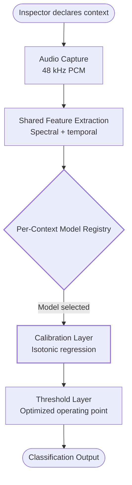

# Research Paper Generation Skill

This skill encodes the **exact workflow** used to produce three iterations of
the HollowWall Inspector research paper. It is designed to be reusable across
projects — any codebase with experimental results, datasets, and model
artifacts can follow this pipeline to produce a submission-ready paper.

## 1. Workflow Overview

The pipeline is an **8-step sequential process**. Do not skip steps or reorder
them — each step's output feeds the next.

### Step 1 — Source Data Gathering

Extract **verified experimental facts** from the codebase before writing a
single sentence of the paper. Sources to mine:

- **Dataset metadata**: sample counts, class distribution, capture methods,
  file paths (e.g., `dataset/.../ground_truth.json`).
- **Model results**: accuracy, recall, false alarm rates, calibration error
  (ECE), confidence intervals — from evaluation scripts output, JSON results,
  or `RESULTS-*.md` files.
- **Code references**: file paths with line numbers for key algorithms (feature
  extraction, training loop, calibration). Example:
  `training_v2/src/hollowwall_v2/features.py:L42`.
- **Configuration**: model hyperparameters, thresholds, feature lists.

**NEVER fabricate numbers.** If a number cannot be traced to a codebase
artifact, mark it as `[TODO: verify]` and flag it for the user. Every
quantitative claim in the final paper MUST have a verifiable source.

**Recommended tools**: `codegraph_explore` (if indexed), `grep`, `read`, and
spawn an `explore` subagent for broad codebase surveys.

### Step 2 — Framing Decision

Pick one of three framings based on the target venue. See **§2 Framing
Decision Tree** below. The framing determines paper structure, tone, what to
emphasize, and what to strip.

### Step 3 — Literature Search & Validation

Delegate to **`autoresearch-research-subagent`** (Tier 2, web-only) with a
detailed prompt specifying:

- The paper's contribution claims (from Step 1 data).
- The framing (from Step 2).
- Specific comparison points needed (e.g., "find papers on pseudo-labeling
  with confidence thresholding", "find transfer learning benchmarks for audio
  classification with <1000 samples").
- Required: author list, title, venue, year, DOI or stable URL for every
  reference.

**Validate every reference** via `webfetch` or `websearch` before inclusion.
See **§8 Reference Validation Rules** for common fabrication traps.

### Step 4 — Paper Drafting

The subagent writes the paper to:

```
docs/research/papers/v<N>-<framing>/PAPER-<name>.md
```

The .md uses:
- YAML metadata block (title, authors, date, status, submission target).
- Standard academic sections (Abstract, Introduction, Related Work, Method,
  Experiments, Results, Discussion, Conclusion, References).
- Inline mermaid code blocks for diagrams (rendered natively on GitHub; rendered
  to PNG for DOCX in Step 5).
- `$$...$$` for LaTeX math (converted to native Word OMML by pandoc).

### Step 5 — Diagram Generation

Render mermaid blocks as **B&W academic-style PNGs** using the `mermaid_generate`
MCP tool. See **§3 B&W Academic Diagram Conventions** for the exact theme and
copy-paste init template.

Each diagram goes into the paper's `assets/` subfolder:

```
docs/research/papers/v<N>-<framing>/assets/<diagram-name>.png
```

**Important**: The `mermaid_generate` tool has transient `ENOENT` errors —
always retry failed renders up to **3 times** before giving up.

### Step 6 — DOCX Conversion

Convert the .md to .docx using `pypandoc`. See **§4 DOCX Conversion Command**
for the exact invocation. Before conversion:
- Replace mermaid code blocks with `` references
  (pandoc does not render mermaid).
- Verify all image paths are relative to the .md file location.

**Submission-ready formatting.** Always pass
`--reference-doc=<path-to-reference-manuscript.docx>` (see §4) so the DOCX
comes out **double-spaced, 12pt Times New Roman, 1-inch margins** — the
standard manuscript format required by ASCE, Elsevier, IEEE, Springer, MDPI.
Run pandoc from the paper's directory (or use `--resource-path`) so image
references resolve; missing this silently drops figures and produces a
<100 KB DOCX. Narrative structure (acronyms defined on first use, Notation
table, IntroConclusion mirror) is governed by
`horseshoe-paper-writing-skill` §7.5.1 and §2.3 — load that skill when
drafting.

### Step 7 — Folder Organization

Follow the intent-based structure. See **§6 Folder Structure Convention**.
Each paper iteration gets its own folder; diagrams live in `assets/`.

### Step 8 — Verification

Run the mandatory verification checklist. See **§7 Verification Checklist**.
Do NOT declare the paper complete until every item passes.

---

## 2. Framing Decision Tree

The target venue determines the framing. This is the **first major decision**
after data gathering — it shapes the entire paper structure.

```
Target venue?
├── ML conference/journal (NeurIPS, ICML, JMLR, Pattern Recognition, Machine Learning)
│   → Use "ml-methodology" framing
│   → Strip application context to one paragraph
│   → RQ-driven structure (RQ1, RQ2, ...)
│   → Emphasize: feature ablations, strategy comparisons, statistical rigor
│   → Folder: papers/v<N>-ml-methodology/
│
├── Built environment / civil engineering (NDT & E International, Automation in
│   Construction, Construction & Building Materials, Engineering Structures)
│   → Use "framework-built-env" framing
│   → Modular framework as central contribution
│   → Empirical/practical tone, field-relevant implications section
│   → Emphasize: practitioner protocol, field deployment, material transferability
│   → Folder: papers/v<N>-framework-built-env/
│
└── Application/system venue (IEEE Sensors, Applied Acoustics)
    → Use "application-system" framing
    → Full system architecture + deployment details
    → Product positioning acceptable
    → Emphasize: end-to-end pipeline, browser deployment, real-time performance
    → Folder: papers/v<N>-application-system/
```

### Framing comparison

| Aspect | ml-methodology | framework-built-env | application-system |
|--------|---------------|--------------------|--------------------|
| Central contribution | ML method comparison | Modular retraining framework | End-to-end NDE system |
| Application context | One paragraph | Woven throughout, practical tone | Full system architecture |
| Structure | RQ1, RQ2, ... | Problem → Framework → Protocol → Case Study | System → Implementation → Deployment |
| Tone | Statistical rigor | Empirical, practitioner-focused | Engineering, product-focused |
| Diagrams | ML pipeline, ablation tables | Framework architecture, extension protocol, flywheel | System architecture, deployment topology |
| Example (HollowWall) | v2 | v3 (current) | v1 |

---

## 3. B&W Academic Diagram Conventions

When generating mermaid diagrams for a research paper, **ALWAYS** use the
following conventions. Academic journals require print-friendly diagrams —
color elements will be rejected or render poorly in grayscale.

### Theme and Colors

- **Theme**: `base` with explicit `themeVariables` for B&W. **Never** use
  `default`, `forest`, or `dark` themes (they inject colors).
- **Color palette**:
  - White fill: `#ffffff` (default node background)
  - Light gray for emphasis: `#f0f0f0` (secondary nodes)
  - Black borders: `#000000`
  - Black text: `#000000`
  - Black arrows/lines: `#000000`
- **Font**: serif (Times New Roman family) to match journal body text.
- **Font size**: `14px` for readability at column width.

### Shape Differentiation (NOT color)

Use shape variety to distinguish node types — never rely on color alone:

| Shape | Mermaid Syntax | Meaning |
|-------|---------------|---------|
| Rounded rectangle | `A([text])` | Inputs / outputs |
| Rectangle | `A[text]` | Process steps |
| Diamond | `A{text}` | Decisions |
| Stadium | `A([text])` with `((` | Start / end states |
| Circle | `A((text))` | Data stores / artifacts |

### Line Styles

- **Solid lines** (`-->`) for forward/primary flow.
- **Dashed lines** (`-.->`) for feedback loops, optional paths, or iterative
  refinement.
- **Border weight**: use `style <node> stroke-width:2px` on critical gates or
  mandatory review steps.

### Copy-Paste Mermaid Init Template

Prepend this to every mermaid diagram block. It forces B&W rendering regardless
of the viewer's default theme:

```
%%{init: {'theme':'base', 'themeVariables': { 'primaryColor': '#ffffff', 'primaryTextColor': '#000000', 'primaryBorderColor': '#000000', 'lineColor': '#000000', 'secondaryColor': '#f0f0f0', 'tertiaryColor': '#ffffff', 'background': '#ffffff', 'mainBkg': '#ffffff', 'secondBkg': '#f0f0f0', 'tertiaryBkg': '#ffffff', 'textColor': '#000000', 'fontFamily': '"Times New Roman", serif', 'fontSize': '14px'}}}%%
```

### Full Example Diagram



### mermaid_generate Tool Retry Policy

The `mermaid_generate` MCP tool has **transient `ENOENT` errors** (the
underlying mermaid-cli occasionally fails to find its puppeteer browser on first
invocation). **Always retry failed renders up to 3 times** with a brief pause
between attempts. If all 3 attempts fail, fall back to writing the mermaid
source and rendering manually via `npx mmdc -i input.mmd -o output.png`.

---

## 4. DOCX Conversion Command

Use `pypandoc` to convert the markdown paper to a Word document with embedded
images, table of contents, and metadata. This is the **exact invocation** that
produced the v1 and v3 .docx files.

**Manuscript formatting.** Submission-ready DOCX must be double-spaced,
12pt Times New Roman, 1-inch margins (per `horseshoe-paper-writing-skill`
§2.3 #11 and §7.6). Apply these via the `reference-manuscript.docx`
template — see Step 6 notes below.

### Prerequisites

```bash
# Install pypandoc with bundled pandoc binary (no system pandoc needed)
pip install --user --break-system-packages pypandoc_binary
```

### Conversion Script

```python
import pypandoc

# Path to the manuscript-formatting reference template
# (double-spaced, 12pt Times New Roman, 1-inch margins)
REFERENCE_DOCX = (
    ".opencode/skills/horseshoe-paper-writing-skill/assets/"
    "reference-manuscript.docx"
)

pypandoc.convert_file(
    src_md_with_image_refs,           # path to the .md file
    'docx',                           # output format
    outputfile=dst_docx,              # path to the .docx output
    format='markdown+tex_math_dollars+pipe_tables+yaml_metadata_block',
    extra_args=[
        '--resource-path=<directory-with-images>',  # folder containing assets/
        '--reference-doc=' + REFERENCE_DOCX,        # manuscript formatting
        '--toc',                                     # table of contents
        '--toc-depth=3',                             # TOC includes H1-H3
        '--standalone',                              # self-contained document
        '--metadata', 'title=Paper Title Here',
        '--metadata', 'author=Author Name',
        '--metadata', 'date=July 2026',
    ],
)
```

### Critical Notes

1. **`--reference-doc` is mandatory for submission-ready DOCX.** Without it,
   pandoc uses its default template (single-spaced, Calibri 11pt). The
   `reference-manuscript.docx` template applies double-spacing, 12pt Times
   New Roman, and TNR on all heading/caption/bibliography styles. Regenerate
   the template via
   `horseshoe-paper-writing-skill/scripts/build_reference_docx.py` if pandoc's
   default changes.

2. **Run pandoc from the paper's directory** (or use `--resource-path`).
   Otherwise pandoc silently drops images and replaces them with alt-text.
   The v3 paper was originally generated at 805 KB with images; running
   from the wrong directory produced a 44 KB DOCX with no images.

3. **Replace mermaid code blocks** in the .md with ``
   references **BEFORE conversion**. Pandoc does not render mermaid — it will
   pass the raw code block through as a code listing, which is not what you want
   in a submission-ready paper.

4. **LaTeX math**: Pandoc converts `$$...$$` display math and `$...$` inline
   math to **native Word OMML equations** (editable in Word's equation editor).
   This is a major advantage over screenshot-based math.

5. **Image embedding**: Pandoc embeds images as binary in `word/media/`. The
   `--resource-path` flag tells pandoc where to find the `assets/` folder.
   Paths inside the .md **must** be correct relative to the resource-path
   directory.

6. **Tables**: Pipe tables (`| col1 | col2 |`) convert to native Word tables
   with proper formatting. Use `pipe_tables` in the format string (included
   above).

7. **YAML metadata block**: The `yaml_metadata_block` format extension reads
   the `---` frontmatter from the .md and applies it as document metadata
   (title, author, date appear in the Word document properties).

---

## 5. Data Visualization for Results Sections

Results sections need **quantitative figures** (bar charts, ROC curves, confusion matrices) in addition to the flow diagrams covered in §3. This section covers conventions for embedding real experimental data visualizations.

### 5.1 Standard Academic Figure Types

| Figure Type | When to Use | B&W Encoding |
|-------------|-------------|--------------|
| Grouped bar chart | Strategy/model comparison (acc / recall / FA) | Hatching patterns (`//`, `\\`, `||`, `--`, `xx`) instead of colors |
| Per-material heatmap | Strategy × material accuracy grid | Grayscale colormap (`Greys`, `binary`) |
| ROC curve | Threshold-free classifier comparison | Line styles (`-`, `--`, `:`, `-.`) per model |
| Confusion matrix | Per-class accuracy breakdown | Annotated grayscale grid |
| Violin / box plot | Feature distribution by class | Side-by-side boxes with median markers |
| Correlation heatmap | Feature redundancy analysis | Grayscale diverging colormap |
| PCA / t-SNE scatter | Class separability visualization | Marker shapes (`o`, `s`, `^`, `D`) per class |
| Feature importance | GBM / tree model interpretation | Horizontal bars, sorted descending |
| Decision boundary | 2D feature space classification | Contour fills (white→light gray→dark gray) |
| Reliability diagram | Probability calibration (ECE) | Diagonal reference line + bar deviations |
| Training curve | Loss / metric vs epoch | Line styles per model variant |

### 5.2 Project-Specific Figure Inventory

The HollowWall project already generates these figures from the experimental pipeline. **Use them rather than regenerating** — they reflect verified data.

| Source File (in `training_v2/reports/figures/`) | Content | Paper Section |
|--------------------------------------------------|---------|---------------|
| `strategy_comparison.png` | 10-strategy LOOCV comparison (bar chart + per-material heatmap) | V.Results — RQ1 |
| `stats_overview.png` | Dataset composition (hollow/solid/noise per material) | IV.Materials |
| `stats_feature_distributions.png` | 10-feature violin plots, hollow vs solid per material, with Cohen's d | III.Methodology — Features |
| `stats_correlation_heatmap.png` | 10×10 Pearson correlation matrix | III.Methodology — Features |
| `stats_pca_projection.png` | 2D PCA scatter + feature loading vectors | III.Methodology — Features |
| `stats_model_performance.png` | Per-material ROC curves + confusion matrices | V.Results |
| `stats_feature_importance.png` | Per-material GBM feature importance | V.Results — RQ2 |
| `stats_decision_boundary.png` | 2D decision surfaces per material | V.Results — RQ1 |
| `train_test_split.png` | Held-out video evaluation results | V.Results |

**To incorporate**: copy the relevant figures into the paper's `assets/` folder, then reference them in the .md with ``.

### 5.3 B&W Conversion of Existing Colored Figures

Existing project figures use color. For journal submission, convert to B&W using matplotlib style templates.

**Bar chart B&W template** (hatching instead of color):
```python
import matplotlib.pyplot as plt
import numpy as np

plt.rcParams.update({
    'font.family': 'serif',
    'font.size': 11,
    'hatch.color': 'black',
    'hatch.linewidth': 0.5,
})

strategies = ['LR 4f', 'LR+Mat', 'Per-Mat LR', 'Per-Mat GBM']
accuracy = [86, 91, 88, 90]
recall = [97, 96, 95, 93]
false_alarm = [60, 33, 30, 24]

x = np.arange(len(strategies))
width = 0.25
hatches = ['//', '\\\\', 'xx']

fig, ax = plt.subplots(figsize=(7, 4))
for i, (vals, label) in enumerate(zip([accuracy, recall, false_alarm],
                                       ['Accuracy', 'Hollow Recall', 'False Alarm'])):
    ax.bar(x + i * width - width, vals, width, label=label,
           edgecolor='black', facecolor='white', hatch=hatches[i])

ax.set_ylabel('Percent (%)')
ax.set_xticks(x)
ax.set_xticklabels(strategies)
ax.legend(frameon=False, loc='upper right')
ax.spines['top'].set_visible(False)
ax.spines['right'].set_visible(False)
plt.tight_layout()
plt.savefig('assets/strategy-comparison-bw.png', dpi=300, bbox_inches='tight')
```

**ROC curve B&W template** (line styles):
```python
linestyles = ['-', '--', ':', '-.']
for i, (fpr, tpr, label) in enumerate(zip(fprs, tprs, labels)):
    plt.plot(fpr, tpr, linestyles[i % 4], color='black',
             label=f'{label} (AUC={aucs[i]:.2f})')
plt.plot([0, 1], [0, 1], 'k:', alpha=0.5)  # chance diagonal
```

**Heatmap B&W template** (grayscale colormap):
```python
plt.imshow(matrix, cmap='Greys', aspect='auto')
# OR for diverging data (correlations): cmap='RdGy' reversed grayscale-reds
```

### 5.4 matplotlib B&W Global Style

Apply once at the top of any figure-generation script:
```python
import matplotlib.pyplot as plt
plt.rcParams.update({
    'font.family': 'serif',
    'font.serif': ['Times New Roman', 'DejaVu Serif'],
    'font.size': 11,
    'axes.edgecolor': 'black',
    'axes.linewidth': 0.8,
    'axes.spines.top': False,
    'axes.spines.right': False,
    'xtick.color': 'black',
    'ytick.color': 'black',
    'axes.labelcolor': 'black',
    'figure.facecolor': 'white',
    'axes.facecolor': 'white',
    'savefig.facecolor': 'white',
    'savefig.edgecolor': 'black',
    'savefig.dpi': 300,
    'hatch.color': 'black',
    'hatch.linewidth': 0.5,
})
```

For seaborn: `sns.set_style('white')` + `sns.despine()` + manually set `palette='Greys'` or `color='black'`.

### 5.5 Caption Conventions

- **Format**: `Figure N. <descriptive caption>. <details>.`
- Number figures sequentially through the paper (Figure 1, 2, 3, ...)
- Captions go BELOW figures; table captions go ABOVE tables
- Always state the sample size and metric in the caption
- Example: `Figure 4. LOOCV strategy comparison (N=370 taps, 28 videos). Bars show accuracy (left hatch), hollow recall (middle hatch), and false alarm (right hatch) for four representative strategies. Per-material GBM (rightmost) achieves the best false-alarm–recall tradeoff.`

### 5.6 Table Conventions

Markdown pipe tables in the .md source convert automatically to native Word tables via pandoc:

```markdown
| Model | Accuracy | Recall | FA |
|-------|----------|--------|----|
| LR 4f | 86%      | 97%    | 60%|
```

Rules:
- **Numerical alignment**: right-align numbers, left-align text
- **Significant figures**: match precision across a column (all percentages to integer %, all errors to 1 decimal)
- **Bold the winner**: `**Per-Mat GBM**` for the best row
- **Caption above**: `**Table N.** Descriptive caption.` (one line above the table)
- **Inline in text**: every table must be referenced in the prose (`Table N shows...`)

For complex tables (multi-level headers, merged cells), export as an image instead — pandoc mangles complex layouts.

### 5.7 Embedding in DOCX

Same as flow diagrams (§3): replace mermaid or generate the PNG via matplotlib, then in the .md:

```markdown

```

Pandoc embeds the PNG as binary in `word/media/` during DOCX conversion. No additional steps needed.

### 5.8 Verification for Data Figures

Additional checklist items for results figures (extends §7):

- [ ] Axes have labels with units (`Accuracy (%)`, not just `Accuracy`)
- [ ] Y-axis starts at 0 for bar charts (no misleading truncated range)
- [ ] Legend has no box (`frameon=False`) and does not overlap data
- [ ] Significance markers (`*`, `**`, `***`) used only when a statistical test was run
- [ ] Figure DPI ≥ 300 for print journals
- [ ] Figure size matches column width (~3.5" for single column, ~7" for full width)
- [ ] Color-free: pass `image-analyzer-subagent` B&W verification

---

## 6. Folder Structure Convention

All research output lives under `docs/research/` with an **intent-based**
hierarchy:

```
docs/research/
├── README.md                                    # Folder index (this pattern)
├── papers/
│   ├── v<N>-<framing>/
│   │   ├── PAPER-<name>.md                      # Primary deliverable
│   │   ├── PAPER-<name>.docx                    # Submission-ready Word
│   │   ├── PAPER-<name>-references.json         # Validated reference list
│   │   └── assets/
│   │       ├── <diagram-1>.png
│   │       └── <diagram-2>.png
│   └── ...
├── notes/                                       # Background research notes
│   ├── RESEARCH-<topic>.md
│   └── REVIEW-<topic>.md
└── results/                                     # Experimental results / outcomes
    └── RESULTS-<experiment>.md
```

### Rules

1. **One folder per paper iteration** — `papers/v1-.../`, `papers/v2-.../`,
   `papers/v3-.../`. Never overwrite an earlier iteration.
2. **Increment version numbers** (v1, v2, v3, ...) — each iteration is preserved
   for comparison and provenance.
3. **Framing suffix** in the folder name matches the framing decision:
   `-application-system`, `-ml-methodology`, `-framework-built-env`.
4. **Each iteration's diagrams live in its own `assets/` subfolder** — no shared
   image pool. This prevents cross-iteration path breakage.
5. **README.md** at `docs/research/` indexes all iterations with a mapping
   table (framing, venue, status, primary file).
6. **Notes** (`notes/`) are background literature reviews and feasibility
   analyses. **Results** (`results/`) are experimental outcome summaries. Both
   feed into paper drafts.
7. **References** are stored as companion `.json` files alongside their paper
   for machine-readability and re-validation.

### Image Path Convention

Inside each paper's `.md`, image references use **relative paths** to the local
`assets/` folder:

```markdown

```

This ensures:
- GitHub renders the image correctly when viewing the .md.
- Pandoc finds the image via `--resource-path=<paper-folder>`.
- The `.docx` embeds the image as binary (paths inside .docx are irrelevant).

---

## 7. Verification Checklist (Mandatory Before Declaring Complete)

For every paper generation, verify **ALL** of the following. Do not skip any
item — a failure on any item means the paper is not submission-ready.

### Content Verification

- [ ] **All quantitative claims match verified source data** — no fabrication.
  Every number (accuracy, recall, sample count, threshold) traces to a codebase
  artifact (script output, JSON, RESULTS-*.md).
- [ ] **All references are REAL papers** with DOI or stable URL. Validate every
  reference via `webfetch` or `websearch`. See §8 for common fabrication traps.
- [ ] **No placeholder text remains** — search for `[TODO`, `[Author`,
  `[verify`, `TBD`, `XXX` and resolve all instances.

### DOCX Verification

- [ ] **DOCX has expected structure**: paragraphs, tables, embedded images,
  OMML equations (not screenshots of math).
- [ ] **Round-trip check**: extract DOCX back to markdown via
  `pypandoc.convert_file(docx_path, 'markdown', ...)` and verify key
  percentages, section headings, and table contents match the source .md.
- [ ] **Images are embedded** — open the .docx as a zip and confirm
  `word/media/` contains the expected PNG files. **A DOCX under 100 KB
  almost certainly has missing images** (a properly-illustrated paper is
  typically 500 KB–2 MB).
- [ ] **Manuscript formatting applied** (per `horseshoe-paper-writing-skill`
  §2.3 #11 and §7.6):
  - Double-spaced throughout (body text, references, captions).
  - 12pt Times New Roman (or Arial).
  - 1-inch margins on all sides.
  - Confirm `--reference-doc=reference-manuscript.docx` was used; the
    default pandoc template produces single-spaced Calibri 11pt.
- [ ] **Run pandoc from the paper directory** (or use `--resource-path`)
  so `assets/*.png` references resolve. Missing this flag silently drops
  images and replaces them with alt-text.

### Diagram Verification

- [ ] **B&W compliance**: spawn `image-analyzer-subagent` to inspect each PNG
  and confirm there are no color elements (only black, white, gray). Color
  diagrams will be rejected by academic journals or render poorly in print.
- [ ] **Text legibility**: diagram text is readable at column width (typically
  ~3.5 inches for two-column journals).
- [ ] **Shape differentiation**: node types are distinguished by shape, not
  color alone.

### Structure Verification

- [ ] **Folder structure matches the intent-based convention** (§6).
- [ ] **README.md** at `docs/research/` is updated if iterations changed.
- [ ] **Image paths inside .md files** resolve correctly (`./assets/<file>`).
- [ ] **File count** before and after reorganization matches (no files lost).

---

## 8. Reference Validation Rules

### Source: autoresearch-research-subagent

Use **`autoresearch-research-subagent`** for the literature review. It is a
Tier 2 (web-only) research loop with no code execution (`bash: deny`). Its job
is to fetch papers, extract structured summaries, and build a validated
reference list.

### Required Fields

Every reference MUST have:
- **Author list** (full names, not just "et al.")
- **Title** (exact)
- **Venue** (journal/conference name)
- **Year**
- **DOI** or stable URL (arXiv ID, ACM DL link, etc.)

### NO Fabrication

If a paper cannot be verified via web search, **omit it**. Do not include
"plausible-sounding" references — reviewers will check, and a single fabricated
reference discredits the entire paper.

### Common Fabrication Traps (observed in practice)

These are real errors the `autoresearch-research-subagent` has caught and
corrected. Watch for them:

| Claimed Reference | Reality | Correction |
|-------------------|---------|------------|
| Roberts et al. cross-validation paper, *Nature Communications* 2021 | Actually published in *Ecography* 2017 | Fix venue and year |
| Arazo et al. confirmation bias, ICML 2020 | Actually arXiv 2019 (not ICML) | Fix venue |
| CLAP audio model, 2022 | Actually ICASSP 2023 | Fix year |
| "Salmon et al." on semi-supervised acoustic classification | **Does not exist** — fabrication trap | Always omit |

### Validation Procedure

For each reference in the draft:
1. `webfetch` the DOI URL or arXiv abstract page.
2. Confirm the title, authors, venue, and year match what's in the paper.
3. If any field mismatches → correct it.
4. If the paper cannot be found at all → **remove the reference** and rephrase
   the citing sentence to not depend on it.

---

## 9. Integration with AGENTS.md

This skill lives at the **project level** (`.opencode/skills/research-paper-generation-skill/`)
and is automatically discovered by OpenCode. To make the primary agent load it
proactively on trigger phrases, register it in the project's `AGENTS.md`.

### Routing Entry

Add a routing row in the project's `AGENTS.md` (at the repository root):

```
| Research paper generation | Load `research-paper-generation-skill` directly | — | Triggers on "research paper", "academic paper", "journal submission", "write paper", "paper draft" |
```

### Placement

Insert the row after the existing "Literature review / paper synthesis" entry
(which routes to `autoresearch-research-subagent`). The distinction:

- **`autoresearch-research-subagent`** → delegated for the literature search
  phase only (Step 3 of this skill).
- **`research-paper-generation-skill`** → loaded by the primary agent for the
  **full paper generation pipeline** (all 8 steps), which includes delegating
  to the subagent as one step.

### If AGENTS.md Does Not Exist

If the project's `AGENTS.md` does not exist, note this as a recommendation
for the user: "Create `AGENTS.md` at the repository root with a Subagent
Routing Preferences table and add the routing entry above."

---

## 10. Example Invocation Flow

### User Prompt

> "Generate a research paper from this codebase's ML experiments, targeting
> NDT & E International. Use the built environment framework angle."

### Agent Response (8 Steps)

**Step 1 — Source Data Gathering:**
Spawn an `explore` subagent to mine the codebase:
- Extract sample counts from `training_v2/dataset/.../ground_truth.json`.
- Extract LOOCV results from `training_v2/scripts/strategy_comparison.py`
  output or cached results.
- Extract feature definitions from
  `training_v2/src/hollowwall_v2/features.py`.
- Extract calibration ECE and threshold sweep results from
  `RESULTS-semi-supervised-and-features.md`.
- Record all file paths with line numbers for citation in the paper.

**Step 2 — Framing Decision:**
Target venue = NDT & E International → **built environment** framing.
Folder: `docs/research/papers/v<N>-framework-built-env/`.
Structure: Problem → Modular Framework → Protocol → Case Study → Field
Implications.

**Step 3 — Literature Search:**
Delegate to `autoresearch-research-subagent` with prompt:
> "Find papers on: (1) acoustic tap-test / impact-echo NDE for tile debonding
> and hollow wall detection; (2) semi-supervised pseudo-labeling with
> confidence thresholding; (3) material-conditional / hierarchical classification
> for small-sample regimes; (4) amplitude-agnostic spectral features for audio
> classification; (5) pretrained audio encoders (Wav2Vec2, CLAP, PANNs) on
> small-sample tasks. Return: author, title, venue, year, DOI for each."
Validate every returned reference via `webfetch`.

**Step 4 — Paper Drafting:**
Subagent writes `PAPER-framework-built-env.md` with:
- YAML metadata (title, authors, CanvasTEKK affiliation, date, submission
  target).
- Abstract (250 words), Introduction, Related Work, Modular Framework (the
  central contribution), Case Study (with all verified numbers), Extension
  Protocol, Discussion, Conclusion, References.
- Inline mermaid blocks for 3 diagrams: framework architecture, pseudo-label
  flywheel, extension protocol.

**Step 5 — Diagram Generation:**
For each mermaid block, prepend the B&W init template (§3) and call
`mermaid_generate` with `outputFormat: 'png'`, saving to:
- `assets/framework-architecture.png`
- `assets/pseudo-label-flywheel.png`
- `assets/extension-protocol.png`
Retry up to 3 times on ENOENT errors.

**Step 6 — DOCX Conversion:**
Create a temporary copy of the .md with mermaid blocks replaced by
`` references. Run `pypandoc.convert_file(...)` with
`--resource-path`, `--toc`, `--standalone`. Output:
`PAPER-framework-built-env.docx`.

**Step 7 — Folder Organization:**
Verify the folder matches §6 convention. Update `docs/research/README.md` with
the new iteration in the mapping table.

**Step 8 — Verification:**
Run the full checklist (§7):
- [ ] All numbers match source data (spot-check 5 key claims).
- [ ] All references validated via web search.
- [ ] DOCX round-trip: extract back to markdown, compare key percentages.
- [ ] B&W compliance: spawn `image-analyzer-subagent` on each PNG.
- [ ] Folder structure correct. README updated.

**Return Contract:**
```
Status: success
Output: docs/research/papers/v3-framework-built-env/PAPER-framework-built-env.md (+ .docx, assets/)
Summary: Generated v3 framework-built-env paper targeting NDT & E International.
  3 B&W diagrams, 25 validated references, DOCX with embedded images + OMML math.
Issues: None
```
