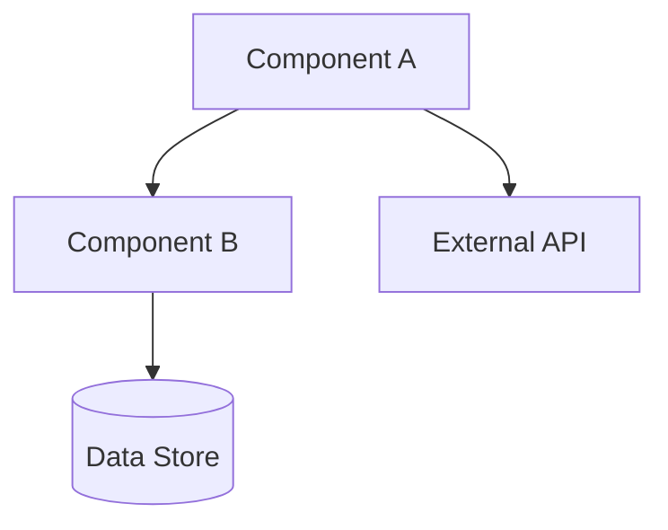
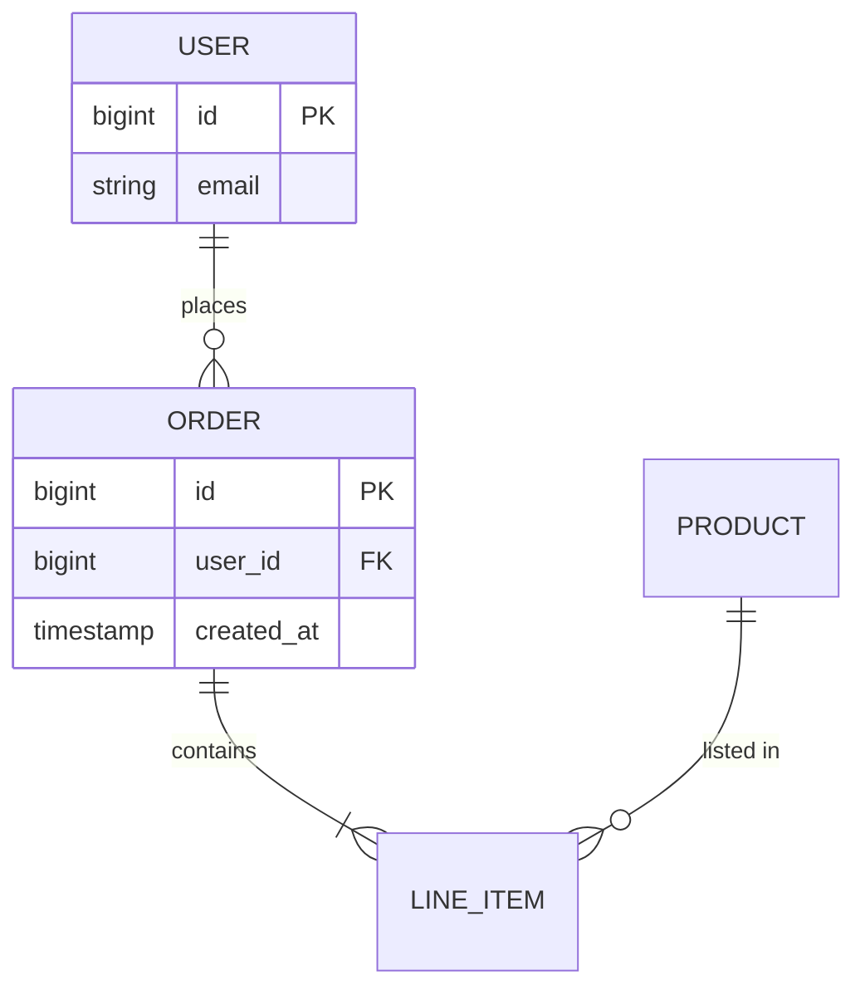
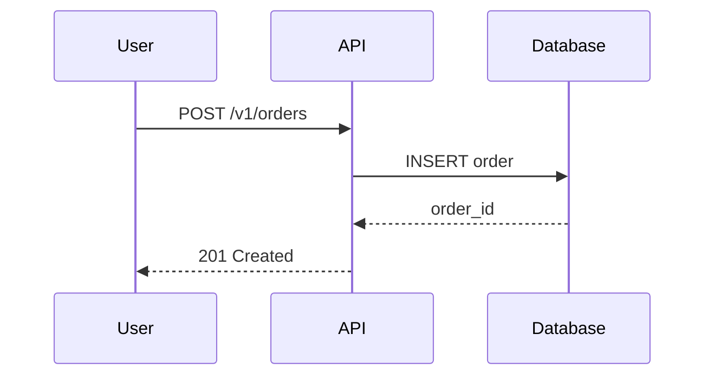

## What I do

I provide a structured **Technical Design Document (TDD)** creation template — the engineering "how" stage of the document ladder, filling the gap between the SRS (requirements) and implementation.

1. **TDD Template** — 7-part structure (System Context / Architecture / Data Model / API Surface / Architecture Decision Records / Sequence Diagrams / Non-Functional Design)
2. **docs/technical-design/ Naming Convention** — ticket-linked files (`TDD-{key}.md`)
3. **Architecture Decision Records (ADRs)** — durable record of WHY each architecture decision was made
4. **CodeGraph-grounded design** — architecture must be validated against the actual codebase, not assumptions

> **Position in the document ladder:** **Vision** (customer-facing) → **BRD** (sponsor/stakeholder) → **SRS** (internal functional/technical requirements) → **TDD** (this template: engineering design) → **implementation**. The TDD translates the SRS's functional requirements into architecture, data model, and API contracts.

> **Name note:** "TDD" here means **T**echnical **D**esign **D**ocument — NOT Test Driven Development. To avoid collision, the authoring subagent is named `technical-design-specialist-subagent` (not `tdd-specialist`), distinct from the existing `tdd-subagent` (Test Driven Development) and `tdd-workflow-skill`.

## When to use me

Use this skill when:
- An SRS or feature spec needs to be translated into a concrete engineering design
- Someone says "technical design", "architecture document", "system design", "design spec", "create technical design"
- Architecture decisions need to be captured as durable ADRs (context → decision → consequences)
- The team needs a shared blueprint before implementation begins

**Do NOT use for:** requirements (use `srs-creation-skill`/`brd-creation-skill`); customer-facing vision (use `vision-creation-skill`); running tests (use `tdd-workflow-skill` — different TDD).

**Trigger phrases**: "technical design", "architecture document", "system design", "technical design doc", "design spec", "create technical design", "design the architecture"

## Audience

The TDD is **for engineers, architects, and tech leads** — the people who will implement and maintain the system. It encodes architecture decisions, trade-offs, data models, API contracts, and the reasoning behind each choice.

## Related

- **`technical-design-specialist-subagent`** — the agent that authors the TDD (this skill is its template)
- **`srs-creation-skill`** — the upstream document; the SRS's functional requirements feed INTO the TDD
- **`brd-creation-skill`** — upstream sponsor-level doc; its Solution Requirements Summary informs the TDD scope
- **`interactive-document-rendering-skill`** — shared HTML + DOCX rendering standard (snapshot HTML for TDD)
- **`api-design-skill`** — referenced for detailed OpenAPI/REST patterns in the API Surface section
- **`domain-modeling-skill`** — sharpens domain terminology for the Data Model section

---

## TDD Template

### Header

```markdown
# Technical Design Document: {Feature/Component Name}

**Status**: Draft | In Review | Approved
**Author**: {name}
**Date**: {YYYY-MM-DD}
**SRS**: docs/srs/SRS-{key}.md _(upstream requirements doc)_
**PLAN**: PLANS/PLAN-{key}.md _(filled when ticket is created)_
```

---

## Part 1. System Context

> Boundaries: what this system is, what it connects to, and where it runs.

### 1.1 System Boundaries

```markdown
## 1.1 System Boundaries

{What is inside this system/component vs outside? Define the scope boundary
clearly so reviewers know what the design covers and what it does not.}
```

### 1.2 External Integrations & Dependencies

```markdown
## 1.2 External Integrations & Dependencies

| Integration | Type | Direction | Contract | Notes |
|-------------|------|-----------|----------|-------|
| {e.g. Stripe API} | REST API | Outbound | API version + webhook | Payment processing |
| {e.g. Postgres} | Database | Outbound | Connection + schema | Primary data store |
```

### 1.3 Deployment Context

```markdown
## 1.3 Deployment Context

- **Environment(s)**: {dev/staging/prod, containerized? serverless?}
- **Scaling model**: {single instance / horizontal / auto-scaling}
- **Network**: {public / private / VPC}
```

---

## Part 2. Architecture

> High-level structure: components, technology stack, and layering.

### 2.1 Component Overview (diagram)

```markdown
## 2.1 Component Overview

{High-level description of the components and how they relate. Include a Mermaid
diagram of the component graph.}


```

### 2.2 Technology Stack & Rationale

```markdown
## 2.2 Technology Stack & Rationale

| Layer | Choice | Rationale |
|-------|--------|-----------|
| {e.g. Runtime} | {e.g. Node.js 20} | {why} |
| {e.g. Data store} | {e.g. Postgres} | {why} |

> Reference `design-patterns-skill` and `search-first-skill` for stack rationale.
```

### 2.3 Layering & Dependency Strategy

```markdown
## 2.3 Layering & Dependency Strategy

{Describe the layering (e.g. clean architecture: domain → application →
infrastructure → presentation) and the dependency rule (dependencies point
inward toward domain). Reference `clean-architecture-skill`.}
```

---

## Part 3. Data Model

> Entities, relationships, and schema. Use a Mermaid ERD.

### 3.1 Entity Relationship Diagram

```markdown
## 3.1 Entity Relationship Diagram


```

### 3.2 Schema Details

```markdown
## 3.2 Schema Details

### {Entity}: {table/collection name}
| Field | Type | Constraints | Notes |
|-------|------|-------------|-------|
| {field} | {type} | {PK/FK/not null/unique} | {desc} |

### Migrations
- {Migration strategy: forward-only / reversible; zero-downtime considerations}
```

---

## Part 4. API Surface

> REST/GraphQL endpoints, event contracts, and internal APIs. Reference `api-design-skill` for detailed OpenAPI patterns and `openapi-contract-adherence-skill` for contract review.

### 4.1 HTTP/GraphQL Endpoints

```markdown
## 4.1 HTTP/GraphQL Endpoints

### `POST /v1/orders` — Create order
- **Request**: `{ "user_id": bigint, "items": [...] }`
- **Response 201**: `{ "order_id": bigint, "status": "created" }`
- **Errors**: 400 (validation), 401 (auth), 409 (duplicate)
- **Idempotency**: {key required?}

> Full OpenAPI spec: see `api-design-skill`. Breaking changes must pass `openapi-contract-adherence-skill`.
```

### 4.2 Event Contracts (async)

```markdown
## 4.2 Event Contracts

| Event | Producer | Consumer(s) | Payload | Trigger |
|-------|----------|-------------|---------|---------|
| `order.created` | Order Service | Inventory, Notification | `{ order_id }` | order persisted |
```

### 4.3 Internal APIs (in-process)

```markdown
## 4.3 Internal APIs

- {Internal module interfaces / ports used for dependency inversion}
```

---

## Part 5. Architecture Decision Records (ADRs)

> Durable record of WHY each significant decision was made. Format: **context → decision → consequences**. Numbered `ADR-NNN`.

### ADR-001: {Decision Title}

```markdown
### ADR-001: {Decision Title}

**Date**: {YYYY-MM-DD}
**Status**: Proposed | Accepted | Superseded by ADR-NNN

**Context**: {What is the issue / what forces are at play? What alternatives were considered?}

**Decision**: {What we decided and why.}

**Consequences**: {Positive: ... / Negative: ... / Neutral: ... / Risks & mitigations: ...}
```

> **ADR numbering**: auto-increments (ADR-001, ADR-002, ...). The first ADR in a new project starts at ADR-001. Superseded ADRs are marked `Status: Superseded by ADR-NNN` and never deleted — they remain as historical record.

---

## Part 6. Sequence / Interaction Diagrams

> Key flows rendered as Mermaid sequence diagrams.

```markdown
## 6. Sequence Diagrams

### Flow: {Name} (e.g. "Create Order — happy path")


```

---

## Part 7. Non-Functional Design

> Performance, scalability, security, observability targets. Per `logging-observability-skill` patterns and `security-audit-skill`.

### 7.1 Performance & Scalability

```markdown
## 7.1 Performance & Scalability

- **Throughput target**: {req/s}
- **Latency target**: {p99 < Xms}
- **Scaling strategy**: {horizontal autoscale on metric Y; connection pooling; caching layer}
```

### 7.2 Security

```markdown
## 7.2 Security

- **AuthN/AuthZ**: {mechanism}
- **Data protection**: {encryption at rest/in transit; secret management}
- **Input validation**: {strategy; reference `authentication-authorization-skill`}
```

### 7.3 Observability

```markdown
## 7.3 Observability

- **Logging**: {structured logging, correlation IDs}
- **Metrics**: {key metrics exposed}
- **Tracing**: {distributed tracing setup}
```

### 7.4 Reliability / Resilience

```markdown
## 7.4 Reliability / Resilience

- **Failure modes**: {what breaks and how it's handled}
- **Retries / circuit breaking**: {strategy}
- **Backups / recovery**: {RPO/RTO}
```

---

## docs/technical-design/ Naming Convention

### Ticket-linked (when a ticket exists)

```
docs/technical-design/TDD-{ticket-key}.md
```

### Draft (before a ticket exists)

```
docs/technical-design/TDD-draft-{kebab-slug}.md
```

### Bidirectional Linkage

| Direction | Field | Location |
|-----------|-------|----------|
| TDD → SRS | `**SRS**: docs/srs/SRS-{key}.md` | TDD header |
| SRS → TDD | (trace each FR to a design element) | TDD body + SRS traceability |

---

## CodeGraph Integration (MANDATORY before finalizing architecture)

**Before finalizing the Architecture section (Part 2), run `codegraph_impact` against the target codebase to validate assumptions about existing boundaries.** Design that contradicts the actual codebase structure will fight the code during implementation.

| When | Tool | Purpose |
|------|------|---------|
| Exploring existing architecture | `codegraph_explore` | Understand boundaries before proposing new structure |
| Before finalizing architecture | `codegraph_impact` (depth 2–3) | Validate blast radius of the proposed design |
| Verifying module boundaries | `codegraph_callers` / `codegraph_callees` | Confirm proposed dependencies respect actual graph |
| Finding integration points | `codegraph_search` | Locate existing interfaces the design must connect to |

If `.codegraph/` does not exist, fall back to `explore` (Task tool) + grep/glob/read — the design must still be grounded in the actual codebase.

---

## Rendering

**Render dual outputs per `interactive-document-rendering-skill` (snapshot for TDD):**
- **Interactive HTML** — rendered once at wrap (`docs/technical-design/{key}/TDD-{key}.interactive.html`), snapshot (not living)
- **Word .docx** — formal deliverable for engineering review & sign-off (`docs/technical-design/TDD-{key}.docx`), auto-TOC + hyperlinked headers + section page-breaks

**Image routing:** if a referenced diagram/screenshot must be interpreted, delegate to `image-analyzer-subagent` (do not interpret inline).

---

## Return Contract

```
**Status:** [success | partial | failed]
**Output:** docs/technical-design/TDD-{key}.md
**Summary:** Technical design authored across 7 parts with M ADRs; written to docs/technical-design/
**Issues:** [blockers or "None"]
```
