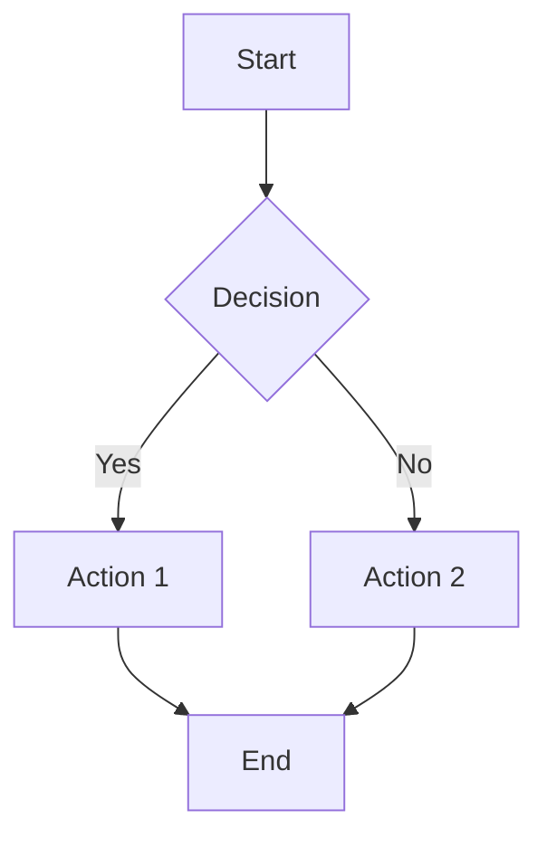
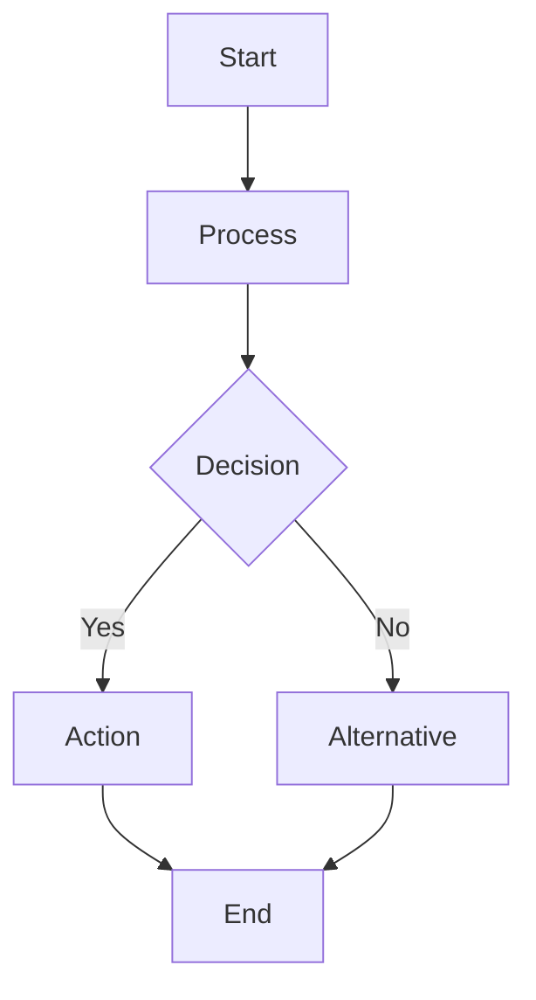
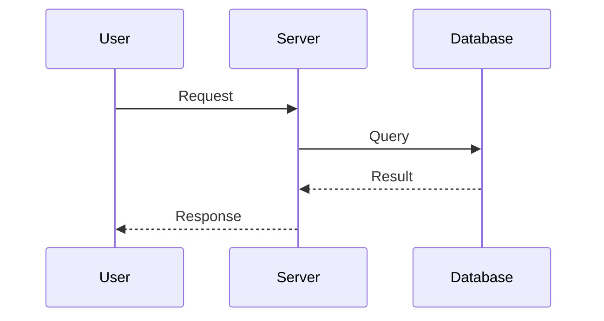
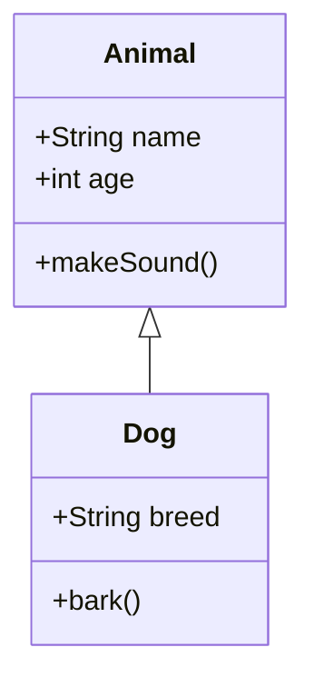
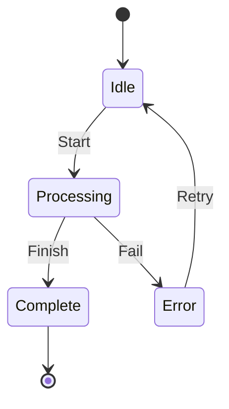
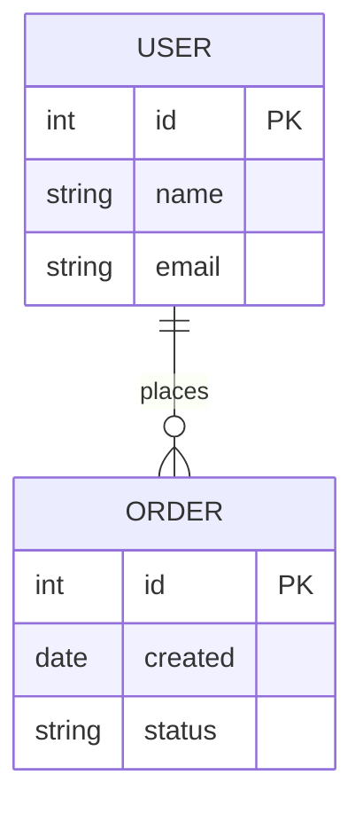
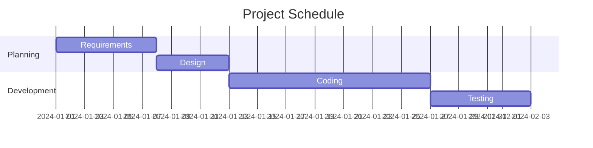

## What I do

I create professional Mermaid diagrams from natural language descriptions and save them as both source files and rendered images:

1. **Parse Diagram Request**: Analyze the user's description to understand diagram type and structure
2. **Generate Mermaid Syntax**: Create valid Mermaid `.mmd` source code
3. **Convert to PNG**: Render diagrams to high-quality PNG images (default: 1920x1080)
4. **Save to PLAN Directories**: Store outputs in `PLANS/PLAN-[issue/ticket-number]/`
5. **Handle Complex Diagrams**: Split large diagrams into multiple files when needed

Supported diagram types:
- Flowcharts (TD, LR, BT, RL)
- Sequence diagrams
- Class diagrams
- State diagrams (v2)
- ER diagrams
- Gantt charts
- Pie charts
- Mind maps
- Git graphs
- User journey
- Timeline

## When to use me

Use this workflow when:
- You need to visualize workflows, processes, or system architecture
- You want Mermaid diagrams for documentation or presentations
- You need to include diagrams in git commits or PLAN files
- You're creating planning documents for GitHub issues or JIRA tickets
- You need to document code logic or system flows visually
- You want diagrams that can be edited later (source .mmd files preserved)

## Rendering Options

### Option 1: Mermaid CLI (Recommended for local use)

Install via npm for direct command-line usage:

```bash
npm install -g @mermaid-js/mermaid-cli
mmdc -i diagram.mmd -o diagram.png
```

### Option 2: Mermaid MCP Server (Recommended for AI integration)

Use `@peng-shawn/mermaid-mcp-server` for AI-powered diagram generation:

- **npm**: `@peng-shawn/mermaid-mcp-server`
- **GitHub**: https://github.com/peng-shawn/mermaid-mcp-server
- **Stars**: 225
- **License**: MIT

```json
{
  "mcpServers": {
    "mermaid": {
      "command": "npx",
      "args": ["-y", "@peng-shawn/mermaid-mcp-server"]
    }
  }
}
```

### Option 3: npx Zero-Install (Fallback)

```bash
npx @mermaid-js/mermaid-cli -i diagram.mmd -o diagram.png
```

## Prerequisites

- **Mermaid CLI** (`mmdc`) or **npx** for rendering
- Node.js 18+ for Mermaid CLI
- Write permissions to output directory

## Steps

### Step 1: Check for Mermaid CLI Installation

Before proceeding, verify that Mermaid CLI is available:

```bash
# Check if mmdc is installed
if command -v mmdc &> /dev/null; then
    echo "✓ Mermaid CLI is installed"
    mmdc --version
else
    echo "⚠️  Mermaid CLI (mmdc) is not installed."
    echo ""
    echo "To install Mermaid CLI, run one of:"
    echo "  npm install -g @mermaid-js/mermaid-cli"
    echo ""
    echo "Or use npx for zero-install (slower):"
    echo "  npx @mermaid-js/mermaid-cli -i diagram.mmd -o diagram.png"
fi
```

### Step 2: Analyze the Diagram Request

- Parse the user's description
- Identify the diagram type needed:
  - **Flowchart**: Process flows, decision trees
  - **Sequence**: Message passing, API calls
  - **Class**: Object-oriented structures
  - **State**: State machines, transitions
  - **ER**: Database schemas
  - **Gantt**: Project timelines
  - **Pie**: Data distribution
  - **Mindmap**: Hierarchical concepts
  - **Gitgraph**: Branch visualization

### Step 3: Generate Mermaid Syntax

Create valid Mermaid code following syntax conventions:



### Step 4: Determine Output Directory

Store diagrams in the appropriate PLAN directory:

| Source | Directory |
|--------|-----------|
| GitHub Issue | `PLANS/PLAN-[issue-number]/` |
| JIRA Ticket | `PLANS/PLAN-[ticket-number]/` |
| General | `diagrams/` |

```bash
# Create directory if it doesn't exist
mkdir -p PLANS/PLAN-136
```

### Step 5: Save Mermaid Source File

Save the `.mmd` source file for future editing:

```bash
cat > PLANS/PLAN-136/architecture.mmd << 'EOF'
flowchart TD
    A[Start] --> B{Decision}
    B -->|Yes| C[Action 1]
    B -->|No| D[Action 2]
    C --> E[End]
    D --> E
EOF
```

### Step 6: Convert to PNG

Render the Mermaid diagram to PNG:

```bash
# Using mmdc (if installed)
mmdc -i PLANS/PLAN-136/architecture.mmd -o PLANS/PLAN-136/architecture.png -w 1920 -H 1080 -b white

# Using npx (fallback)
npx @mermaid-js/mermaid-cli -i PLANS/PLAN-136/architecture.mmd -o PLANS/PLAN-136/architecture.png -w 1920 -H 1080
```

### Step 7: Verify and Report

- Verify the PNG was created successfully
- Display the file paths to the user
- Offer to open or include in documentation

```bash
ls -la PLANS/PLAN-136/
```

## File Storage Convention

```
PLANS/
├── PLAN-GIT-136/
│   ├── architecture-flowchart.mmd
│   ├── architecture-flowchart.png
│   ├── sequence-diagram.mmd
│   └── sequence-diagram.png
└── PLAN-IBIS-456/
    ├── deployment-flow.mmd
    └── deployment-flow.png
```

## Diagram Types Reference

### Flowchart



### Sequence Diagram



### Class Diagram



### State Diagram



### ER Diagram



### Gantt Chart



### Git Graph

```mermaid
gitgraph
    commit
    branch develop
    checkout develop
    commit
    commit
    checkout main
    merge develop
    commit
```

## Handling Large Diagrams

When diagrams exceed rendering limits or become too complex:

1. **Detect complexity**: Count nodes/connections
2. **Offer splitting**: Break into sub-diagrams
3. **Create overview**: High-level summary diagram
4. **Link diagrams**: Reference between files

**Example Split Strategy**:
```
PLANS/PLAN-136/
├── architecture-overview.mmd      # High-level view
├── architecture-overview.png
├── architecture-auth-flow.mmd     # Auth subsystem
├── architecture-auth-flow.png
├── architecture-data-flow.mmd     # Data subsystem
└── architecture-data-flow.png
```

## Common Issues

### Mermaid CLI Not Installed

**Issue**: `mmdc: command not found`

**Solution**:
```bash
# Install globally
npm install -g @mermaid-js/mermaid-cli

# Or use npx for zero-install
npx @mermaid-js/mermaid-cli -i diagram.mmd -o diagram.png
```

### Puppeteer/Chrome Issues (MCP Server)

**Issue**: Browser-related errors with MCP server

**Solution**:
```bash
# Install Chrome dependencies (Linux)
sudo apt-get install -y libnss3 libatk1.0-0 libatk-bridge2.0-0 libcups2 libdrm2 libxkbcommon0 libxcomposite1 libxdamage1 libxfixes3 libxrandr2 libgbm1 libasound2

# Or use CLI instead of MCP server
npm install -g @mermaid-js/mermaid-cli
```

### Mermaid Syntax Errors

**Issue**: Diagram fails to render

**Solution**:
- Validate syntax with Mermaid Live Editor: https://mermaid.live
- Check for reserved words (use quotes: `["Date"]`)
- Ensure proper indentation
- Verify diagram type declaration

### Image Quality Issues

**Issue**: PNG is blurry or small

**Solution**:
```bash
# Increase dimensions
mmdc -i diagram.mmd -o diagram.png -w 2560 -H 1440

# Use higher scale
mmdc -i diagram.mmd -o diagram.png -w 1920 -H 1080 --scale 2
```

## Best Practices

- **Keep source files**: Always save `.mmd` files for future editing
- **Use descriptive names**: `auth-flow.mmd` not `diagram1.mmd`
- **Default to HD**: Use 1920x1080 minimum for PNG output
- **Theme consistency**: Use consistent theme (default, dark, forest, neutral)
- **White background**: Use `-b white` for better compatibility
- **Organize by PLAN**: Store related diagrams together in PLAN directories
- **Document context**: Include comments in .mmd files

## Integration with Planning Workflows

### ticket-plan-workflow

When creating plans for GitHub issues or JIRA tickets, diagrams are stored alongside PLAN files:

**GitHub Issues**:
```bash
# After creating issue plan
mkdir -p PLANS/PLAN-136
# Create diagram
mmdc -i PLANS/PLAN-136/flow.mmd -o PLANS/PLAN-136/flow.png
# Reference in PLAN.md
echo "" >> PLANS/PLAN-GIT-136.md
```

**JIRA Tickets**:
```bash
mkdir -p PLANS/PLAN-PROJ-123
mmdc -i PLANS/PLAN-PROJ-123/architecture.mmd -o PLANS/PLAN-PROJ-123/architecture.png
```

## Verification Commands

```bash
# Check Mermaid CLI version
mmdc --version

# List diagrams in PLAN directory
ls -la PLANS/PLAN-136/*.png

# Validate Mermaid syntax (dry run)
mmdc -i diagram.mmd -o /dev/null

# View image info
file PLANS/PLAN-136/architecture.png
identify PLANS/PLAN-136/architecture.png  # ImageMagick
```

## Troubleshooting Checklist

Before creating the diagram:
- [ ] Mermaid CLI is installed or npx is available
- [ ] Output directory exists or can be created
- [ ] Diagram type is appropriate for the content
- [ ] Mermaid syntax is valid

After creating the diagram:
- [ ] `.mmd` source file saved
- [ ] PNG file was created successfully
- [ ] Image dimensions are appropriate
- [ ] Files are in correct PLAN directory
- [ ] File paths reported to user
